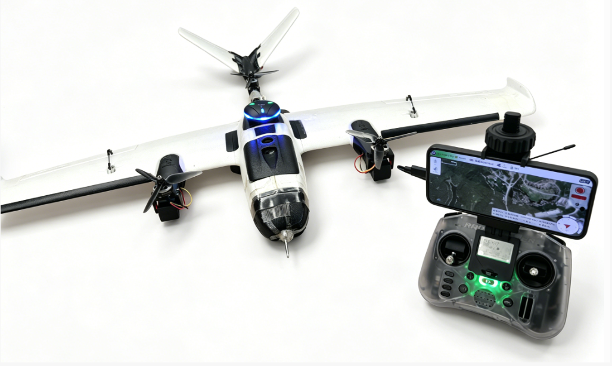
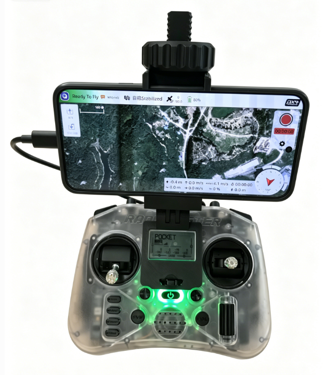
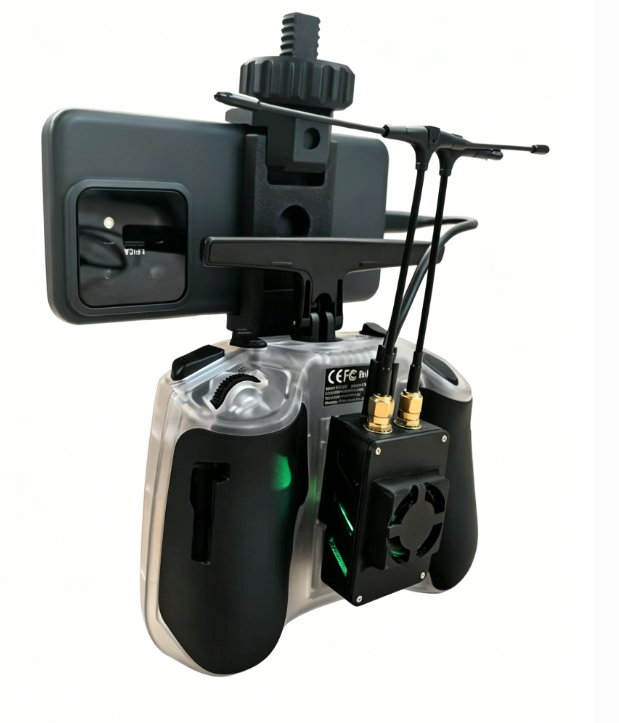

# SwiftWingS3

SwiftWingS3是一款专为入门学习固定翼飞行而设计的垂起固定翼无人机

无需大量前期准备，拿上遥控器和高频头、手机、飞机即可开始学习固定翼飞行。
1. S3 vtol垂起降落，不受起飞降落场地限制，自由起降。
2. 简易拆装，3分钟即可拆卸和安装，方便测试携带。
3. 打开手机APP连接高频头，即可无线查看飞控参数、飞机姿态、当前位置朝向和高度，以及调整参数、PID调参、任务规划等功能。
4. MLRS数传链路使用快拆nano仓和CH1.25接口，支持灵活更换新遥控器和飞控设备。
5. MLRS数传链路默认10mw双频低功耗，支持500mW双频大功率，理想条件下，通信距离可达3km。
6. S3 vtol配置有地理围栏、链路丢失、低电量警告等安全保护，防止固定翼意外炸机。
7. 支持多种飞行模式，包括固定翼模式、多旋翼模式以及对应的自稳、定高、定点模式等，满足入门和进阶飞行需求。
8. 多速度飞行，支持不同速度的飞行，包括低速16米每秒到22米每秒。
9. 使用40A电调，动力强劲有余，能够支持入门和进阶飞行的动力要求。

* 遥数一体，手机实时查看和调整飞机参数

* 纯铜被动散热和风扇主动散热，确保长时间通信稳定。

