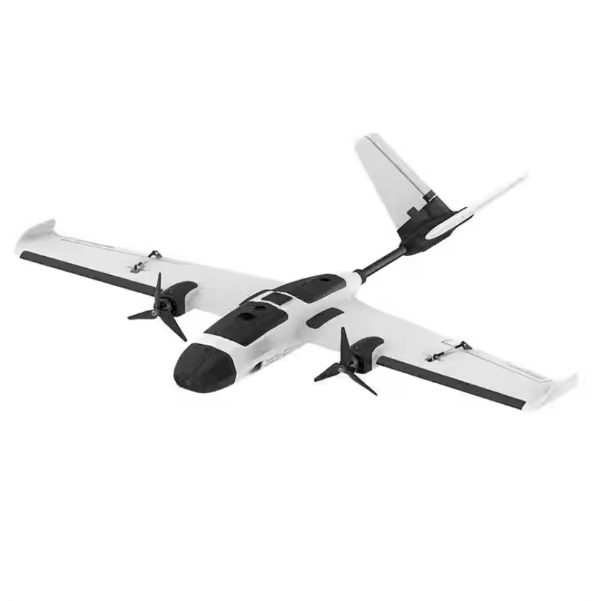
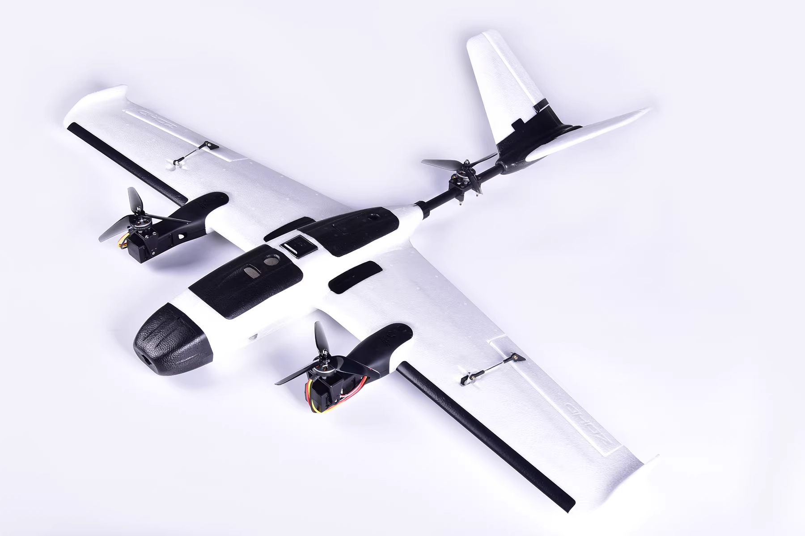
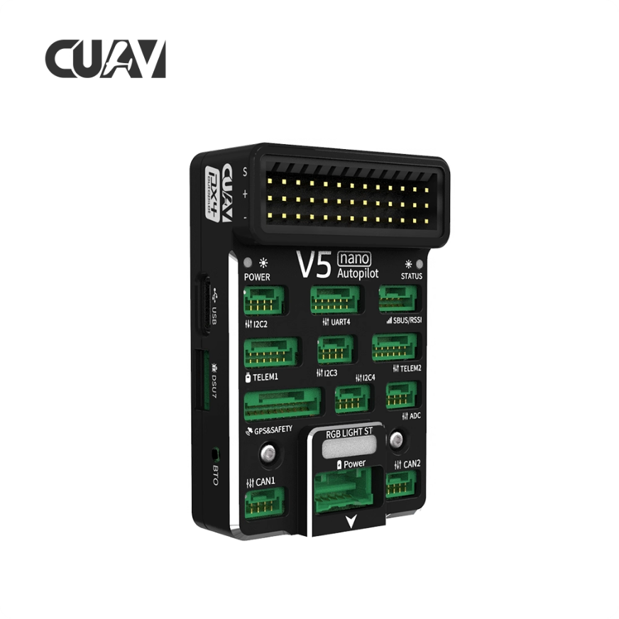
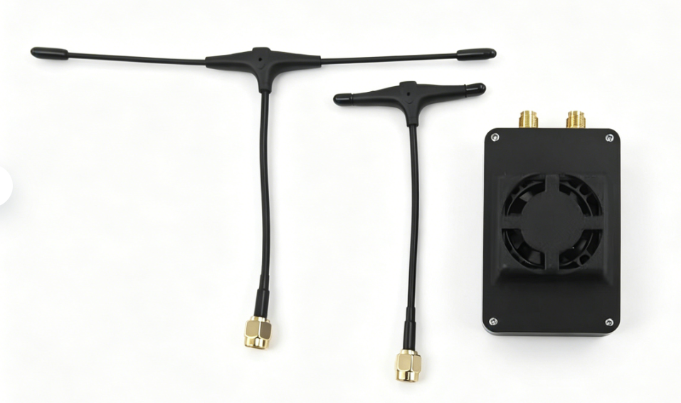
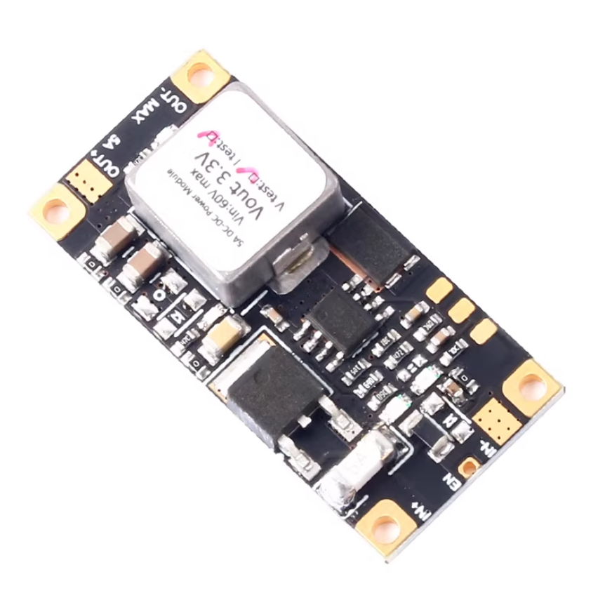
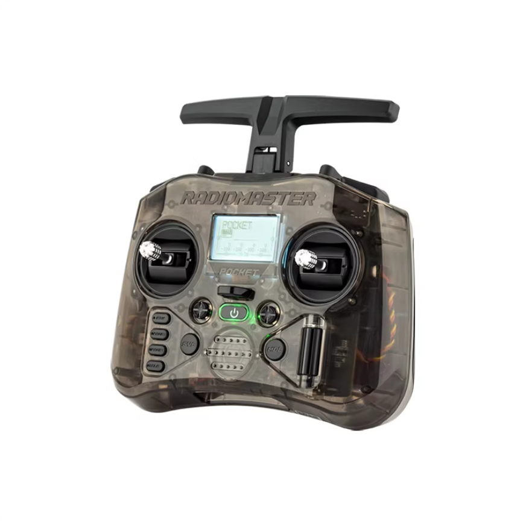
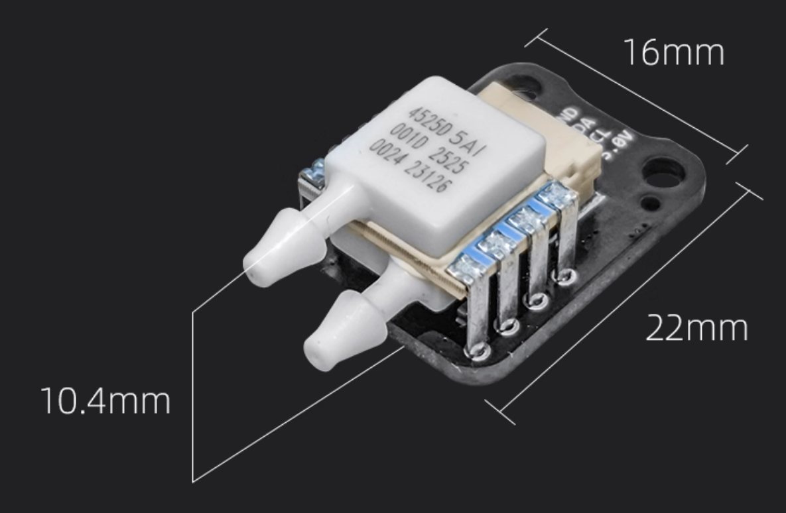
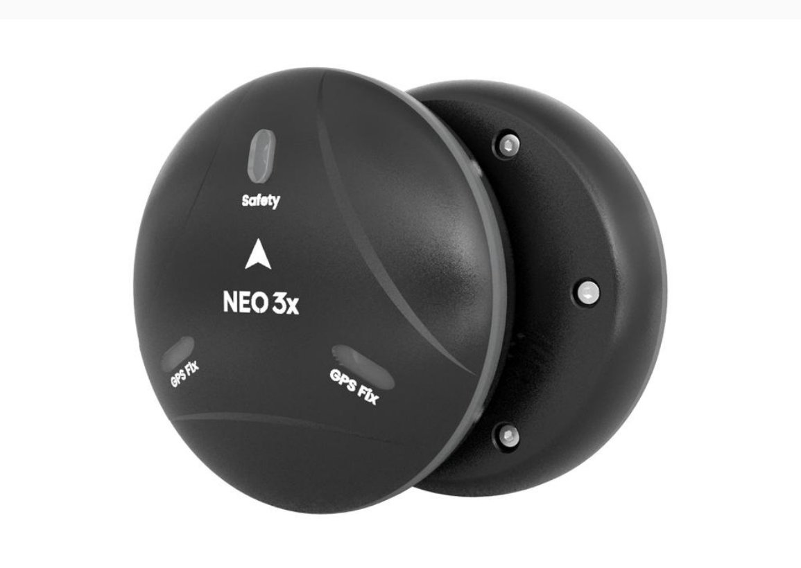
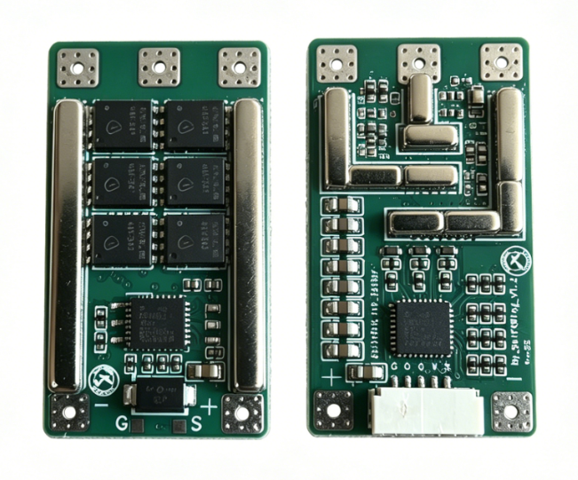

# S3硬件介绍

## 1.技术规格

### S3产品视图

| 参数         | 数值                                                 |
| ------------ | ---------------------------------------------------- |
| 产品名称     | SwiftWingS3双发固定翼                             |
| 重量         | 950g（推荐，实测起飞重量）                           |
| 尺寸         | 翼展：980mm  长度：770mm                             |
| 最大起飞重量 | 1.4kg                                                |
| 续航         | 30min（21700/4S1P5000MAH）                           |
| 电池推荐     | 21700/4S1P2200-3700MAH，18650/4S2P（需要做成长条形） |
| 电机         | 2306  1800kv                                 |
| 电调         | SwiftWing 40A（持续40A，峰值50A，3~6s Lipo） |
| 舵机         | 9g 金属舵机                                  |
| 螺旋桨       | 5 寸三叶桨                                   |
| 工作温度     | -10~40℃                                     |

| 参数         | 数值                                         |
| ------------ | -------------------------------------------- |
| 产品名称     | SwiftWingS3垂起固定翼                        |
| 重量         | 1.33kg （实测起飞重量）                      |
| 尺寸         | 翼展: 980mm 长度: 770mm                      |
| 最大起飞重量 | 1.4kg                                        |
| 续航         | 20min（21700/4S1P5000MAH）                   |
| 电机         | 2306  1800kv                                 |
| 电调         | SwiftWing 40A（持续40A，峰值50A，3~6s Lipo） |
| 舵机         | 9g 金属舵机                                  |
| 螺旋桨       | 5 寸三叶桨                                   |
| 工作温度     | -10~40℃                                     |

### S3飞行参数

| 参数         | 数值         |
| ------------ | ------------ |
| 固定翼飞行续航时间 | 20分钟   |
| 旋翼定点悬停续航时间 | 5分钟   |
| 旋翼平飞速度 | 3m/s           |
| 旋翼升降速度 | 3m/s           |
| 旋翼GPS悬停精度 | ±0.5m      |
| 固定翼平飞最大允许速度 | 20m/s |
| 固定翼上升最大允许速度 | 3m/s  |
| 固定翼下降最大允许速度 | 2m/s  |
| 固定翼最小平飞允许速度 | 16m/s |

## 2.硬件介绍

### ① 飞控

#### V5 nano飞控

| 参数     | 数值                                                              |
| -------- | ----------------------------------------------------------------- |
| 主处理器 | STM32F765(32 Bit Arm® Cortex®-M7, 216MHz, 2MB flash, 512KB RAM) |
| 加速计   | ICM-20602/ICM-20689/BMI055                                        |
| 陀螺仪   | ICM-20602/ICM-20689/BMI055                                        |
| 电子罗盘 | IST8310                                                           |
| 气压计   | MS5611                                                            |
| 尺寸     | 46*64*22mm                                                      |
| 重量     | 91g                                                               |

### ②  MLRS S3 双频高频头

| 参数       | 数值                            |
| ---------- | ------------------------------- |
| 物品       | MLRS S3 双频高频头              |
| 功能集成   | 遥控遥测一体                    |
| 适用范围   | 无人机，无人船，无人车，等      |
| 功能与接口 | 支持 SBUS,CRSF 遥控协议输入输出 |
| 连接方式   | Type-C                          |
| 通信协议   | 支持 Mavlink，Msp，透传         |
| 功率   | 10mw~100mW （默认10mw）                  |
| 散热   | 纯铜被动散热和风扇主动散热                 |

### ③ DC5A 直流电源模块

| 项目     | 规格                 |
| -------- | -------------------- |
| 产品名称 | DC5A 直流电源模块    |
| 输入电压 | 直流 4.5V~60V        |
| 输出电压 | 5V (可任意定制电压)  |
| 输出电流 | 5A（最大 6A）        |
| 待机电流 | 146uA                |
| 输出纹波 | 小于 50mV            |
| 电路结构 | 非隔离 Buck Eco-mode |
| 转换效率 | 96%                  |
| 外形尺寸 | 43mm×20mm           |
| 最厚高度 | 8mm                  |
| 工作温度 | -40℃~+150℃         |
| 产品净重 | 10g                  |

### ④ 遥控器

| 参数         | 数值                                                                   |
| ------------ | ---------------------------------------------------------------------- |
| 物品         | Poket遥控器                                                            |
| 物理尺寸     | 156.6*65.1*125.3mm（折叠尺寸）/156.6*73.1*154.8mm（展开尺寸）      |
| 重量         | 288克                                                                  |
| 工作频率     | 2.400GHz-2.480GHz                                                      |
| 内部射频选项 | CC2500 多协议 / ELRS 2.4GHz                                            |
| 支持的协议   | 模块相关                                                               |
| 工作电压     | 6.6-8.4伏直流                                                          |
| 操作系统     | EdgeTX                                                                 |
| 控制通道     | 最大16个（依赖接收器）                                                 |
| 显示屏       | 128*64 单色液晶屏                                                      |
| 电池         | 2组18650电池（不含）                                                   |
| 充电         | 内置USB-C QC3充电                                                      |
| 可升级固件   | 通过USB或随附的SD卡                                                    |
| 万向节       | 霍尔效应                                                               |
| 模块舱       | 纳米尺寸（兼容RadioMaster纳米尺寸模块、TBS纳米Crossfire / 纳米追踪器） |

### ⑤ 空速计

| 参数类别   | 具体参数                                |
| ---------- | --------------------------------------- |
| 核心传感器 | 4525DO高精度空速传感器                  |
| 测量范围   | 0-50m/s                                 |
| 适配飞控   | PX4、APM固件飞控                        |
| 工作电压   | 5V（飞控直插供电）                      |
| 工作温度   | -10℃-85℃                              |
| 产品重量   | 3.7±0.1g（仅模块，不含硅胶管和金属管） |
| 输出信号   | I2C                                     |
| 模块尺寸   | 22 * 16 * 10.4                          |

### ⑥ GPS NEO3X

| 参数       | 数值                                                                                            |
| ---------- | ----------------------------------------------------------------------------------------------- |
| 处理器     | STM32F412                                                                                       |
| 通信协议   | DroneCAN                                                                                        |
| 电子罗盘   | RM3100                                                                                          |
| 气压计     | ICP-20100                                                                                       |
| 卫星接收器 | Ublox M9N                                                                                       |
| 工作频段   | GPS: L1C/A ` `GLONASS:L10F ` `北斗:B1I ` `Galileo:E1B/C                          |
| 并发器数量 | 4                                                                                               |
| 定位精度   | 1.5m(实测最高0.7m)                                                                              |
| 搜星数量   | 32+                                                                                             |
| 捕获速度   | 冷启动 24S ` `再次捕获 2S ` `辅助启动 2S                                              |
| 导航刷新率 | 5Hz(默认），最大25Hz                                                                            |
| 灵敏度     | 追踪 & 导航：-167dBM ` `冷启动: -148dBM ` `热启动： -159dBM ` `重新捕获: -160dBM |
| 防护等级   | IP66                                                                                            |
| 工作电压   | 4.7~5.2V                                                                                        |
| 工作温度   | -10~70℃                                                                                        |
| 尺寸       | 67*67*21.2mm                                                                                  |
| 重量       | 46g(不含电缆）                                                                                  |

### ⑦ SwiftWing 40A电调

| 参数类别   | 具体参数                         |
| ---------- | -------------------------------- |
| 型号       | SwiftWing 40A                    |
| 持续工作电流 | 40A                              |
| 峰值电流   | 50A                              |
| 电调回传   | 支持（不支持串口回传）           |
| 板载电流计 | 不支持                           |
| 板载电容   | 9pcs贴片低ESR陶瓷电容（提供更好滤波效果，有效抑制开关尖峰和噪声，无需外接大电容，系统更稳定） |
| 输入电压   | 3~6s Lipo                        |
| 主控芯片   | STM32F421K8U7                    |
| 尺寸       | 39mm * 21.5mm * 8.3mm                      |
| 固件类型   | AM32                             |
| 协议       | DShot 150/300/600/MultiShot/OneShot etc. |
