# **起飞前舵面偏转测试说明**

- 起飞前需确认固定翼模式下舵面的偏转方向正确，避免出现控制出错。一般情况下，飞机整机安装完成后，且未拆装机体、未更改遥控器配置或飞控的 actuator 参数，无需重复测试。**但如果发生以下任一情况，必须重新进行地面测试**：
  - 飞控重新接线；
  - 修改遥控器相关配置；
  - 调整飞控中 actuator 相关参数。

*旋翼模式检测*

* 检查电机转向是否正确，左前电机应为顺时针旋转，右前电机和尾电机应为逆时针旋转

* 向右打偏航，左电机应向前

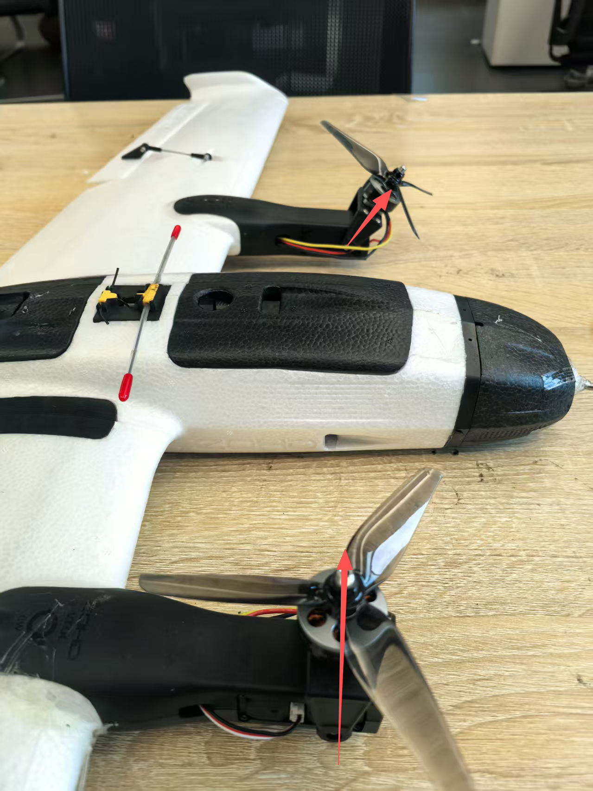

* 向左打偏航，右电机应向前

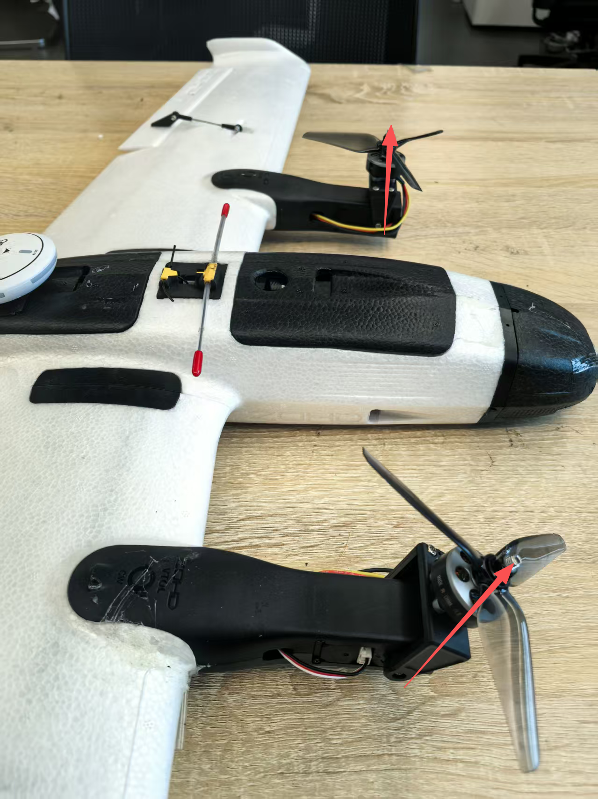

## **重心配平**

重心配平是飞机飞行性能的关键因素，直接影响飞行稳定性和操控性。正确的重心位置能够确保飞机在各种飞行状态下保持平衡，减少不必要的操控修正，提高飞行效率。

### 重心调整方法

1. **推荐重心位置**：根据设计要求，飞机的重心应位于机翼前缘后约25-30%平均气动弦长处
2. **调整步骤**：
   - 移除螺旋桨，关闭电源
   - 使用两个手指或专用重心尺在推荐的重心位置支撑飞机
   - 观察飞机是否水平平衡
   - 如机头过重，将电池向后移动；如机尾过重，将电池向前移动
   - 对于21700/4S1P5000MAH电池，可通过调整电池在电池仓内的位置来微调重心
   - 对于18650/4S2P电池，由于需要做成长条形，安装时需特别注意其在机身中的位置

<!-- 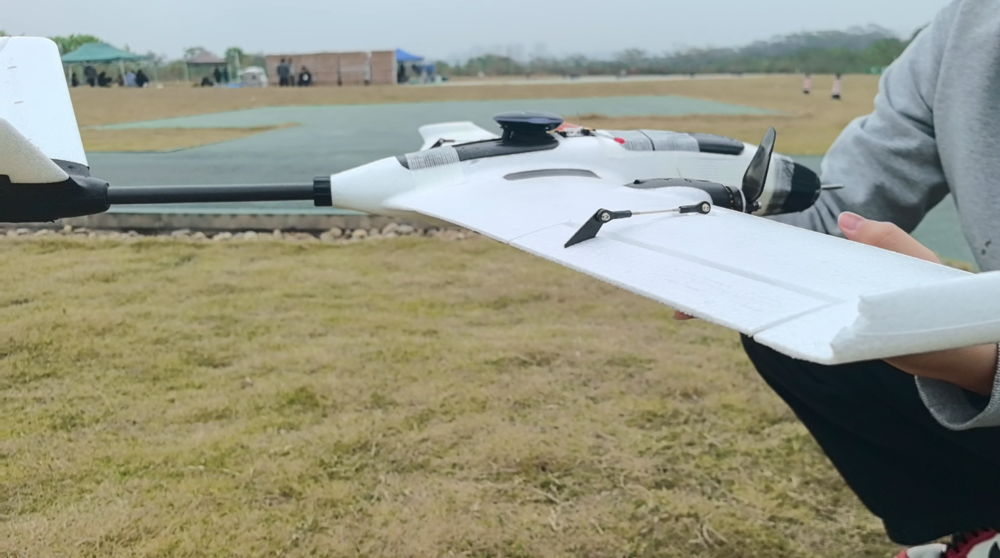 -->

### 重心检查要点

- 每次飞行前都应检查重心，特别是更换电池类型或位置后
- 重心调整完成后，确保电池固定牢固，避免飞行中因电池移动导致重心变化
- 推荐起飞重量为950g，在此重量下进行重心调整可获得最佳飞行性能
- 重心调整合适的飞机在投掷时应能平稳飞行，不会出现明显的抬头或低头趋势

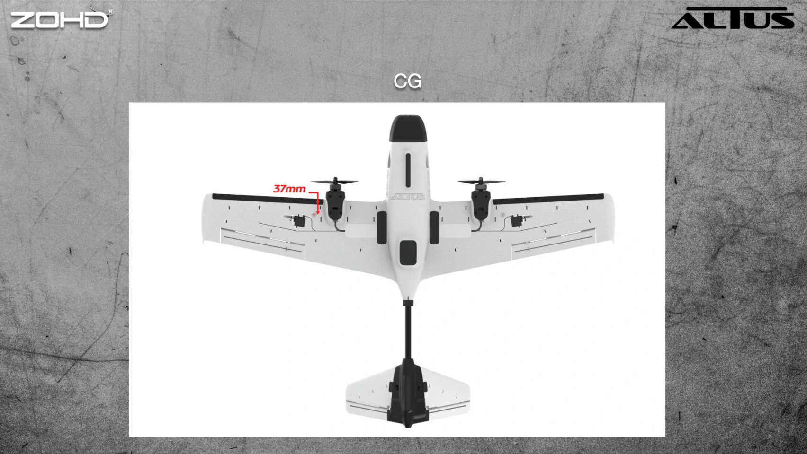

## **地面测试前的设备准备**

* 需准备以下设备：遥控器，思翼通讯链路地面端，elrs接收机，思翼通讯链路网线，8800毫安动力电池，RTK基站，笔记本电脑

* 将思翼通讯链路网线插入的LAN端口，另一端插入笔记本电脑的USB端口。同时，用type-c数据线分别将电脑与思翼地面站和RTK基站相连。

## **起飞前地面传感器校准**

* 连接飞控，打开电脑版QGC地面站，点击左上角图标，选择第二个设置

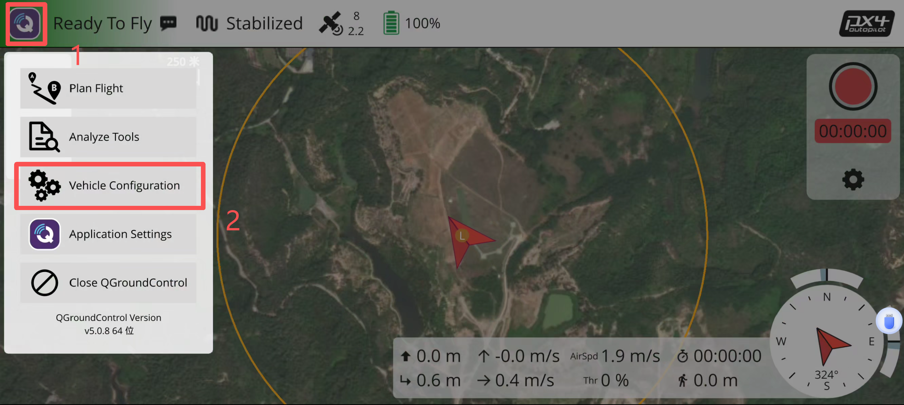

* 点击传感器设置，点击罗盘，点击OK，开始校准罗盘

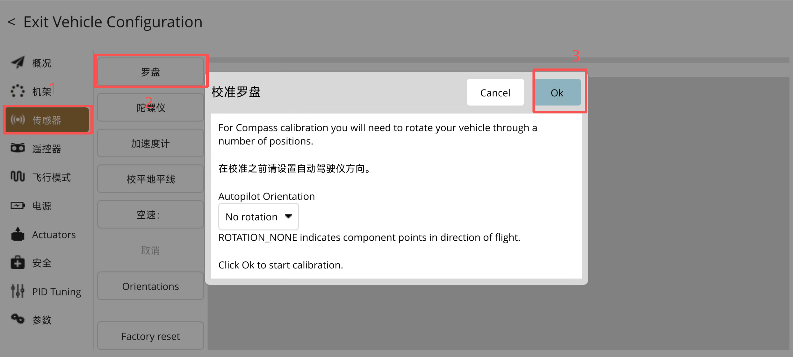

* 红色方框变成黄色后，说明检测到当前姿态，即可逆时针转动无人机，

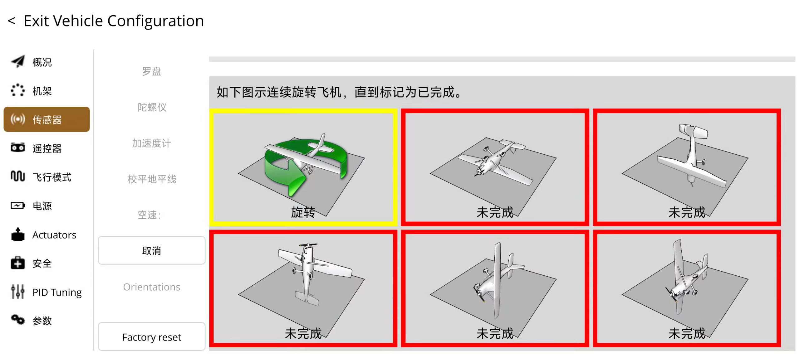

* 在逆时针转动无人机中，黄色方框变为绿色，说明该姿态校准完毕，将无人机放置到下一姿态，然后静止，等待识别，按照提示操作即可

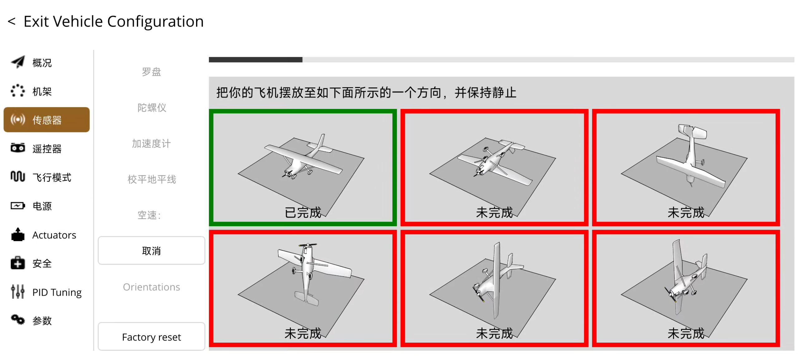

* 校准完成后需拔电重启飞行器，才能正常使用

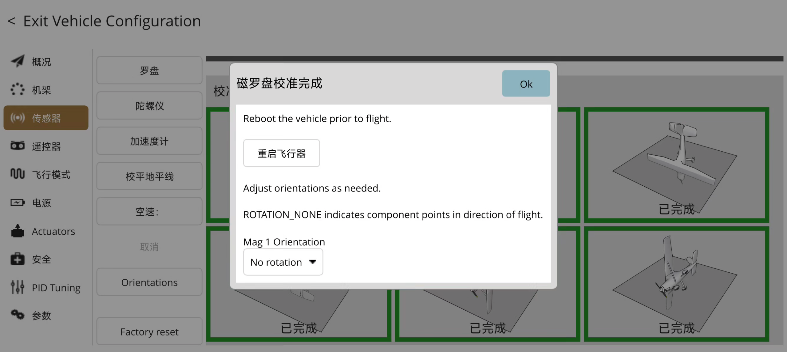

* 进行空速的校准前，需要先用手挡住空速管，然后点击空速校准
* 点击空速计，点击OK，开始校准

吹气注意事项
1、深吸一口气，吹气方向正对空速管的动压孔；
2、距离空速管的动压孔 3-5cm，均匀、缓慢、持续向前吹气；
3、如果失败可以多次尝试。
*[cal] calibration started: airspeed*     校准已启动：空速
*[cal] Ensure sensor is not measuring wind*     确保传感器未在测量风速

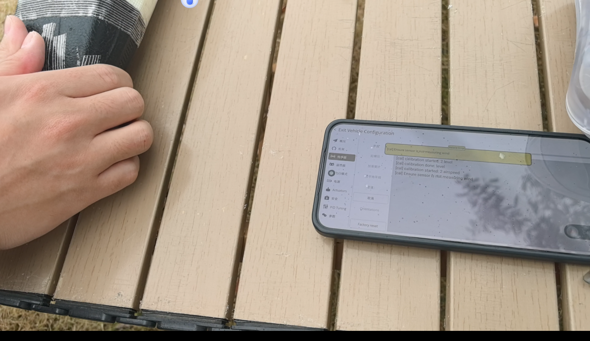

* *[cal] Blow into front pitot without touching*    出现语音提示，对空速管吹气
* *[cal] calibration done: airspeed*     校准已完成：空速

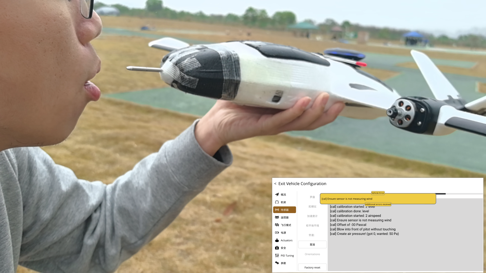

## **详细检查步骤：**

- **卸下螺旋桨（断电状态下操作）**

  * 首先，在确保无人机断电的前提下，使用M8套筒或老虎钳卸下电机螺丝，依次拆除2个螺旋桨。

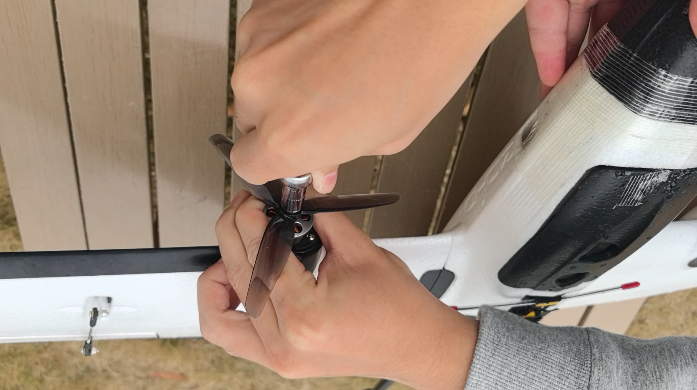
  

- **检查电机转向（自稳模式）**

  1. 使用遥控器将飞行模式切换至“自稳模式（Stabilize）”，解开油门锁并后，按下解锁按钮。
  2. 缓慢推动油门，电机轻声转动即可，主要检查各电机的转向是否正确：

  * 从前视角看，左前电机应顺时针旋转；
  * 右前电机应逆时针旋转。

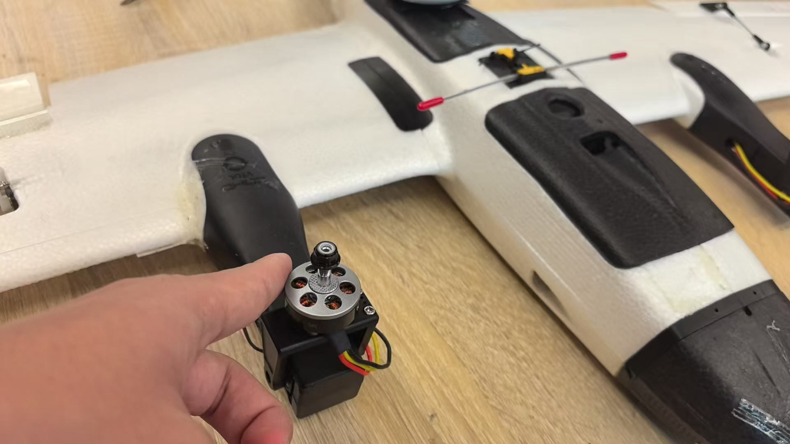

- **舵面动作检测（固定翼模式）**

  * 切换至固定翼模式后，将油门收至0位。维持“自稳模式”，操作遥控器检查各舵面动作：
    * 模拟飞机飞行姿态，观察自稳模式下舵面是否有让飞机姿态能够回中的趋势
    * 若飞机姿态为向左滚转（如图所示），飞控修正姿态有向右回中的趋势，反应到舵面应为右副翼上，左副翼下。
    
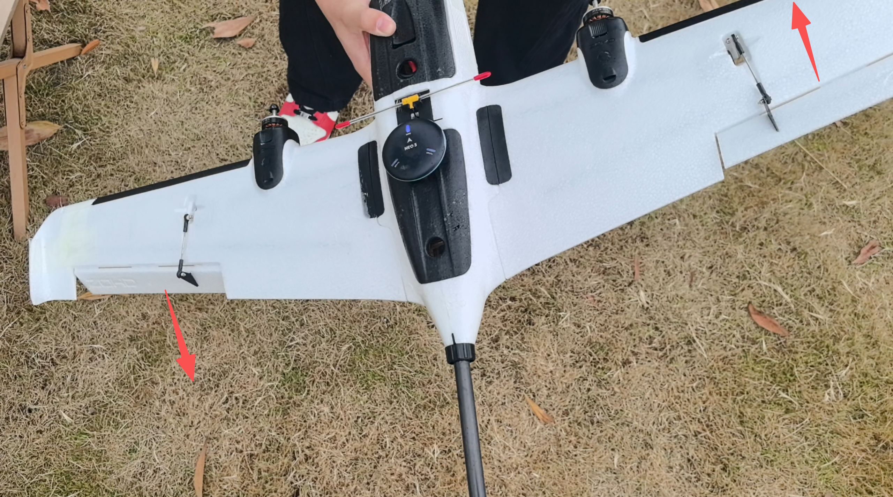

* 同理，机头上翘，舵面应为向下。

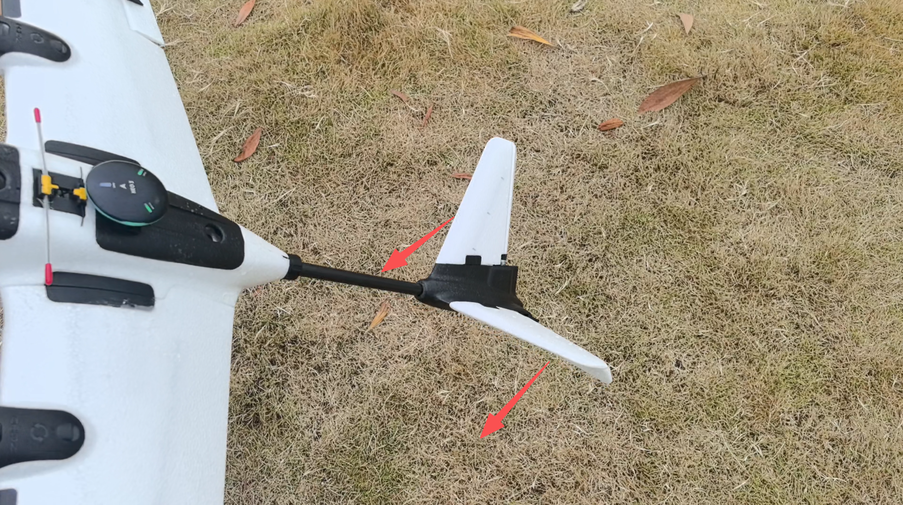

- 左右打副翼杆，检查副翼是否正确偏转；

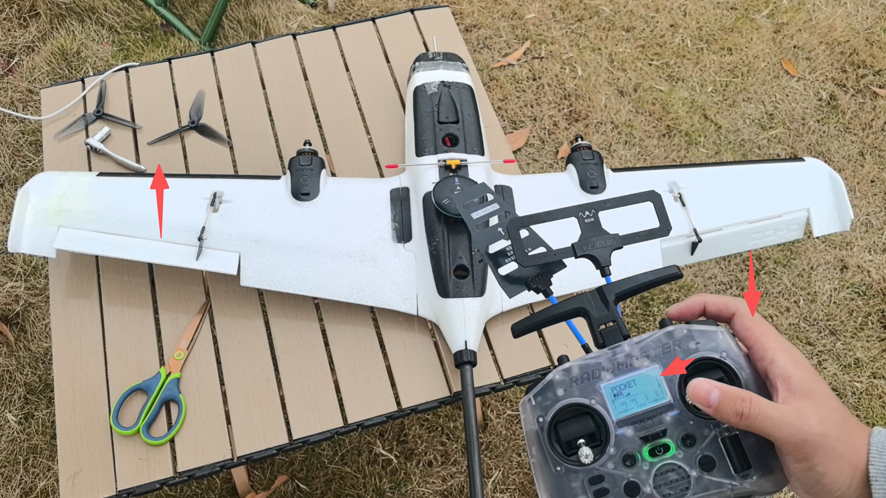

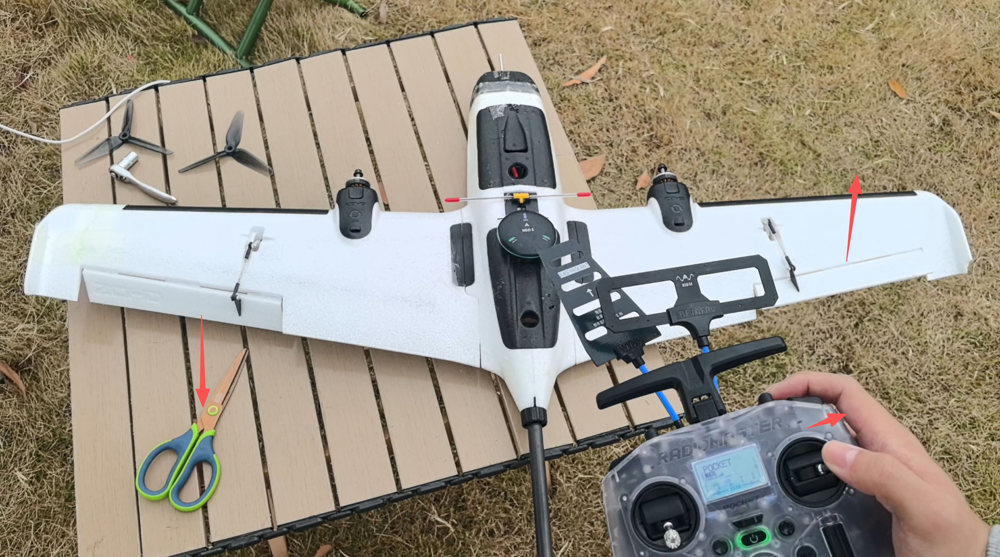

* 上下打俯仰杆，检查升降舵动作是否正确；

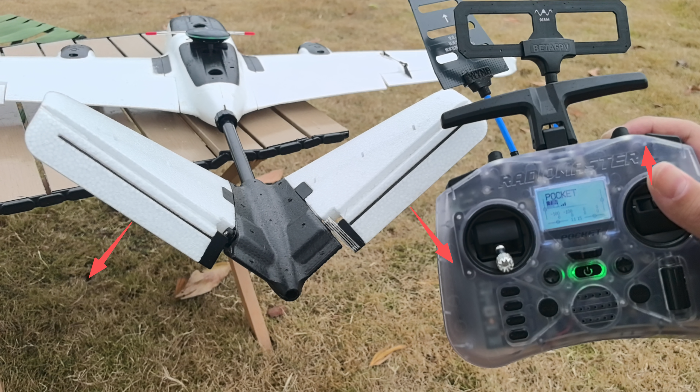

* 左右打偏航杆，检查方向舵是否响应正常。

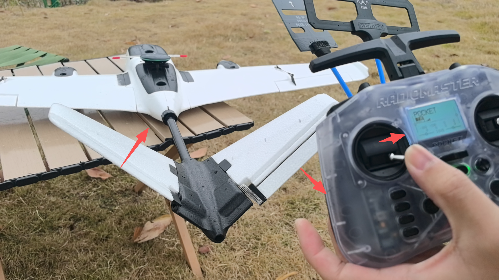

