# 开箱组装

## 开箱

* 检查产品包装是否完整
* 检查产品包装是否有损坏
* 检查产品包装是否有缺失

## 物品清单说明

*总览*

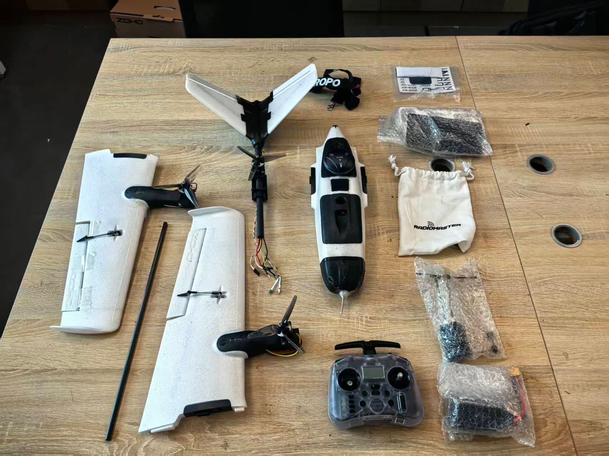

*机身主体*

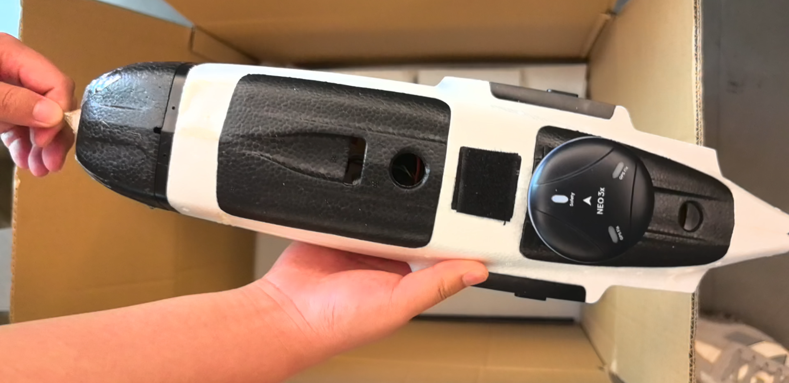

*尾翼*

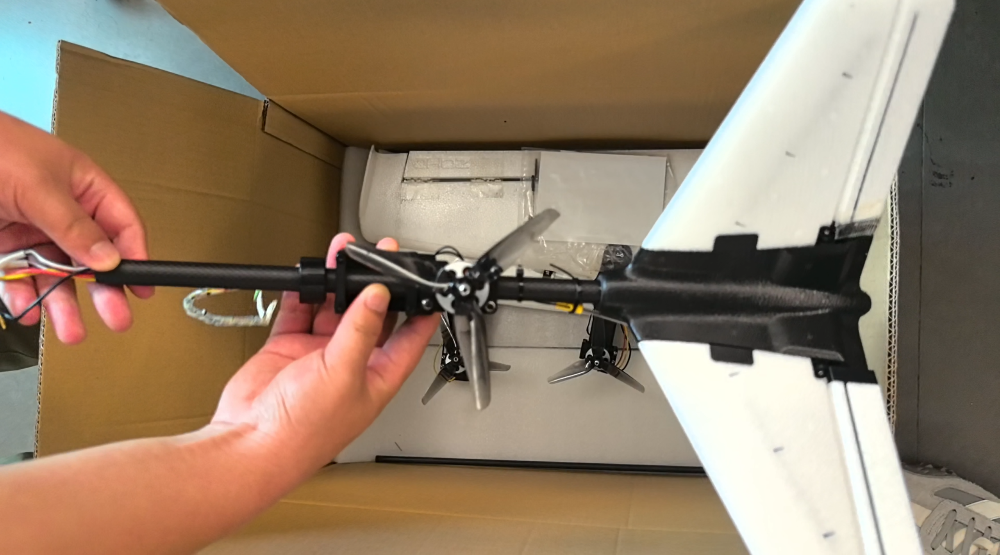

*机翼一对*

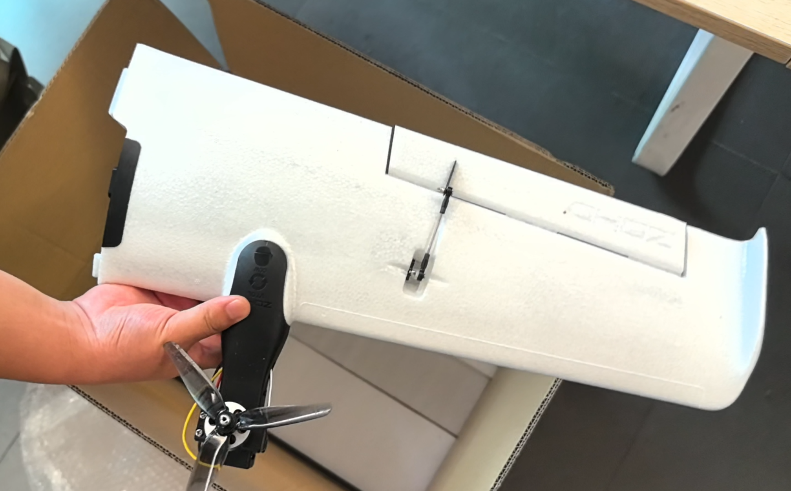

*机翼主碳管*

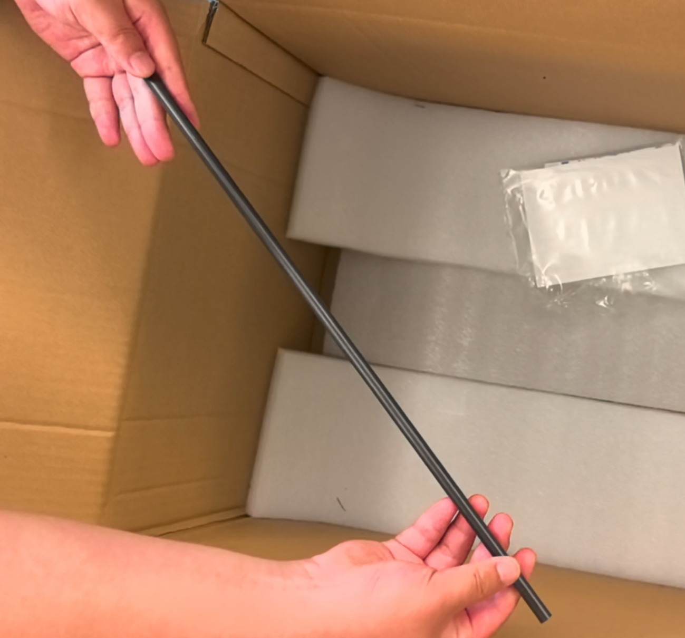

*4S电池*

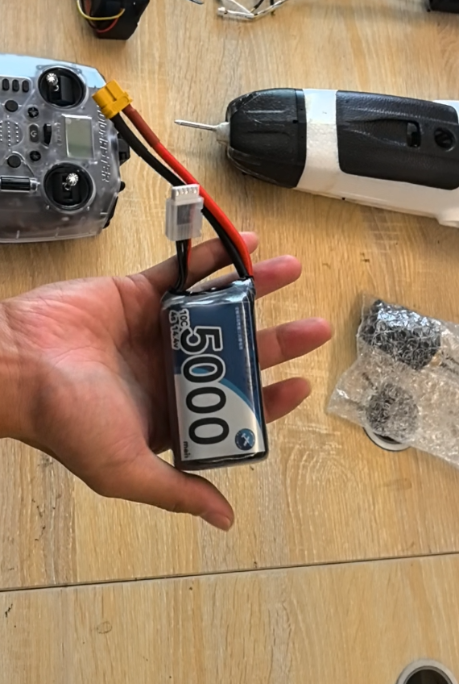

*遥控器及高频头*

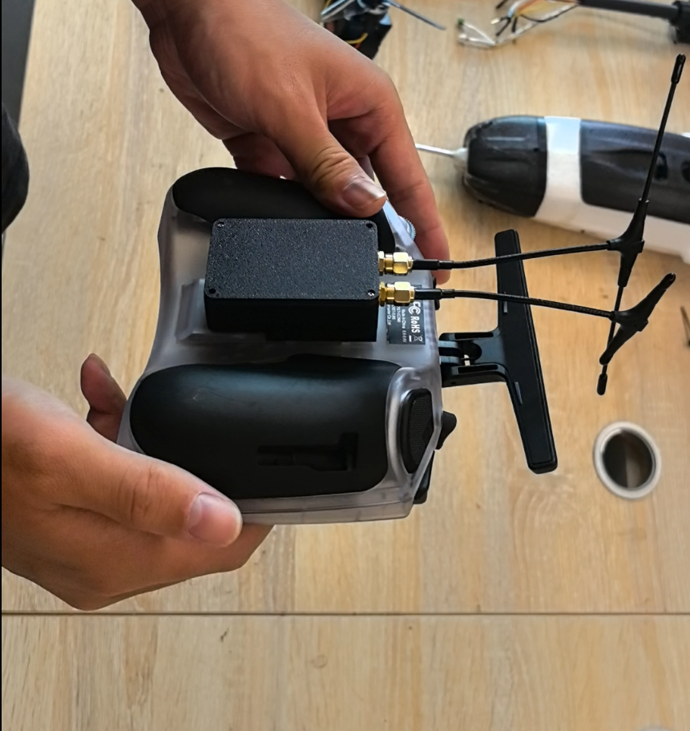

*机翼固定螺丝*

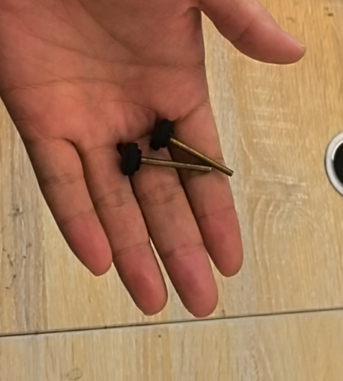

## 组装测试

### *机身主体组装*

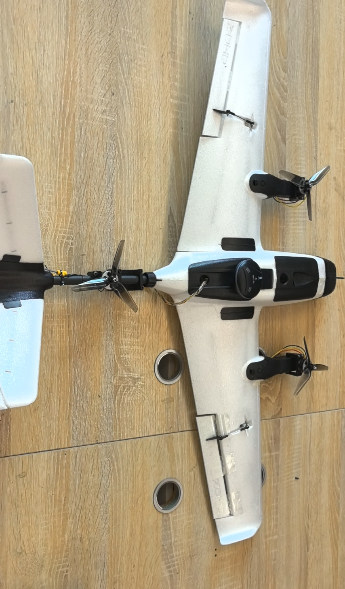

*机翼固定螺丝安装*

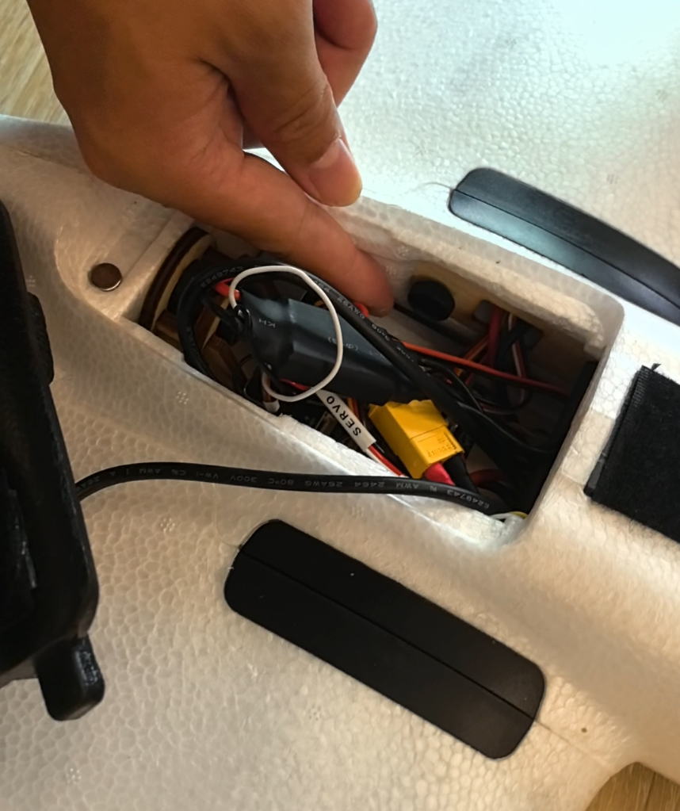

*尾翼安装*

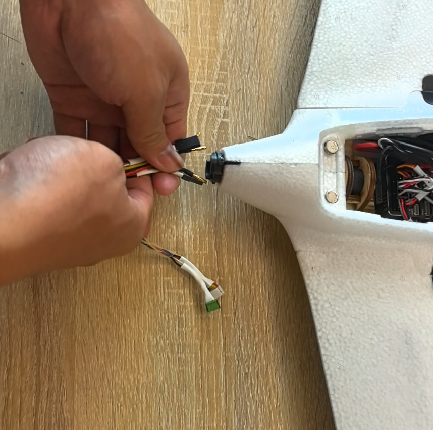

*电机接线*

* 如图所示按照对应颜色接入对应接口

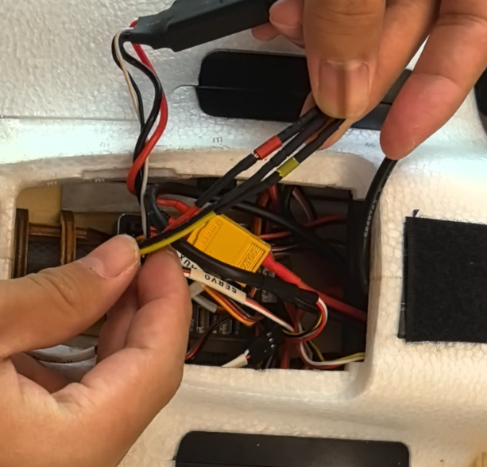

*V型尾翼接线*

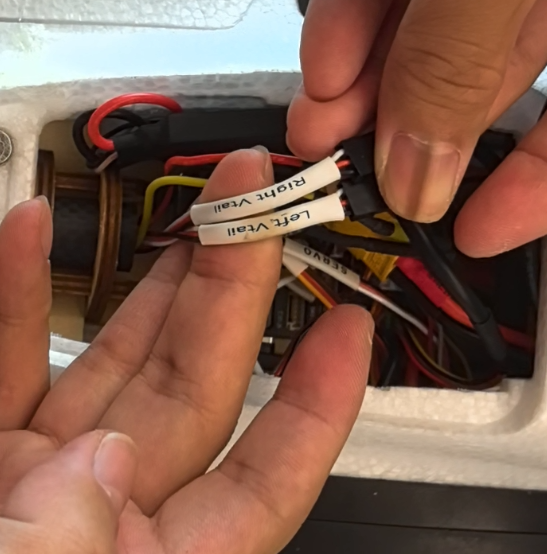

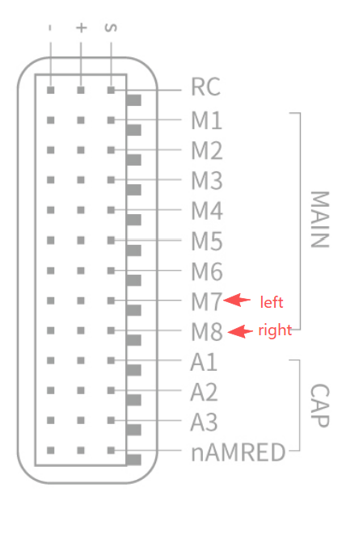

*MLRS接收机接线*

* 按照标签介入对应接口

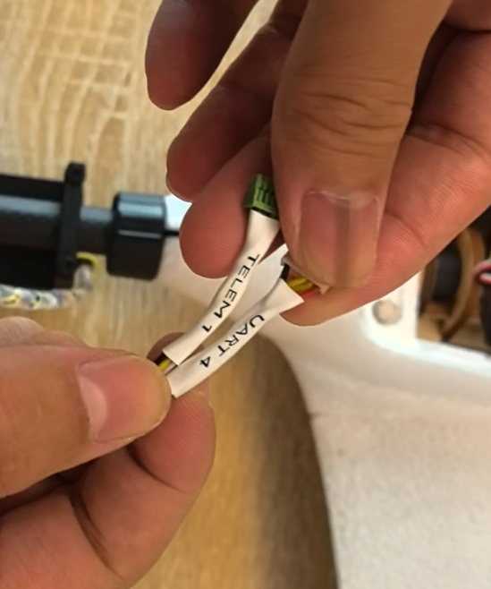

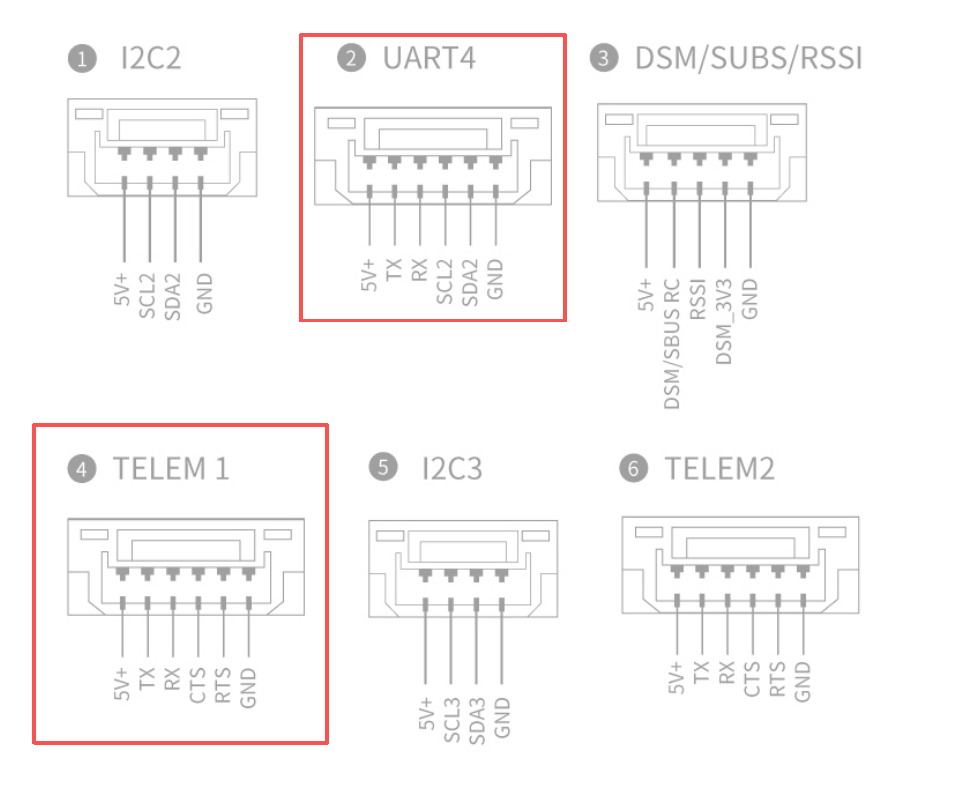

g)
