# 完整飞行演示

## 准备阶段

1. 确认电池电量充足
2. 检查确认固定翼舵面正常
3. 检查电机转向无误（左前顺时针，右前和尾电机逆时针），注意螺旋桨安装方向上与电机转向同向的螺旋桨，螺母一定要固定死
4. 用纤维胶带将飞机舱盖粘好防止意外脱落

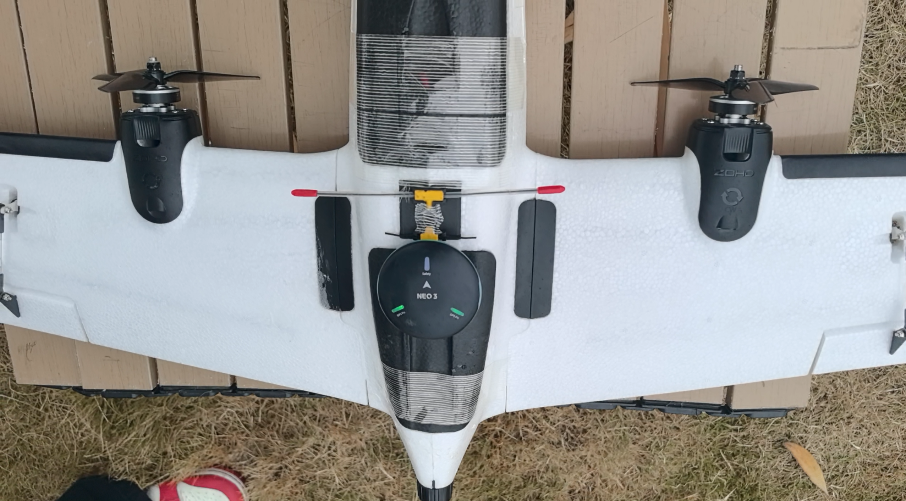

## 解锁抛飞

* 待定点模式下出现“ready to fly”（大致搜星至12颗星以上），可进行解锁起飞

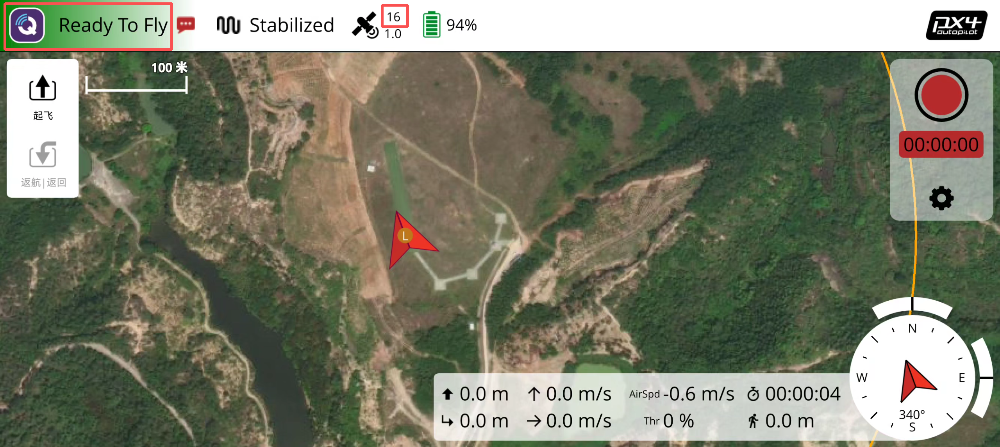

* 对向逆风方向，自稳模式模式抛飞，抛飞时与地面夹角呈15度，不宜过高，否则会导致无人机容易向后翻滚，不宜过低，否则会导致无人机容易向前砸地，遥控器左手油门摇杆向上推至60%以上，准备就绪即可抛飞
  * 注意：需要熟悉自稳模式，最好有飞行经验，起飞后可切换其他模式飞行

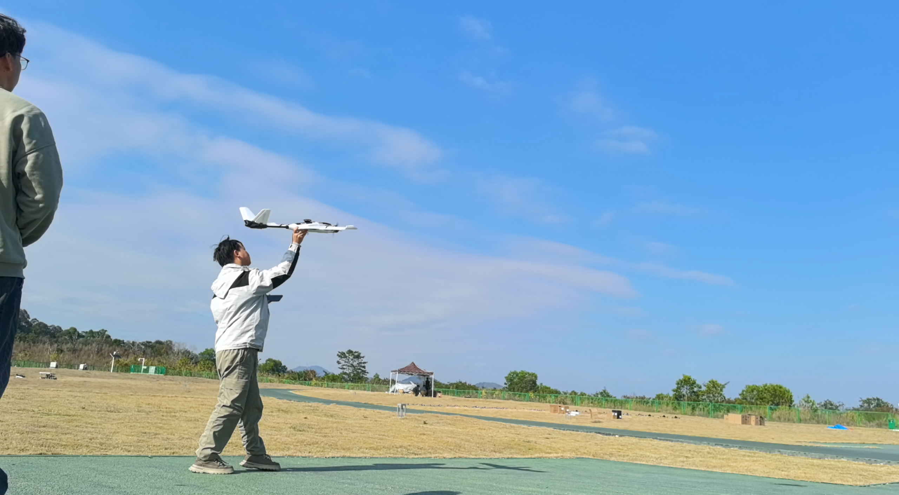

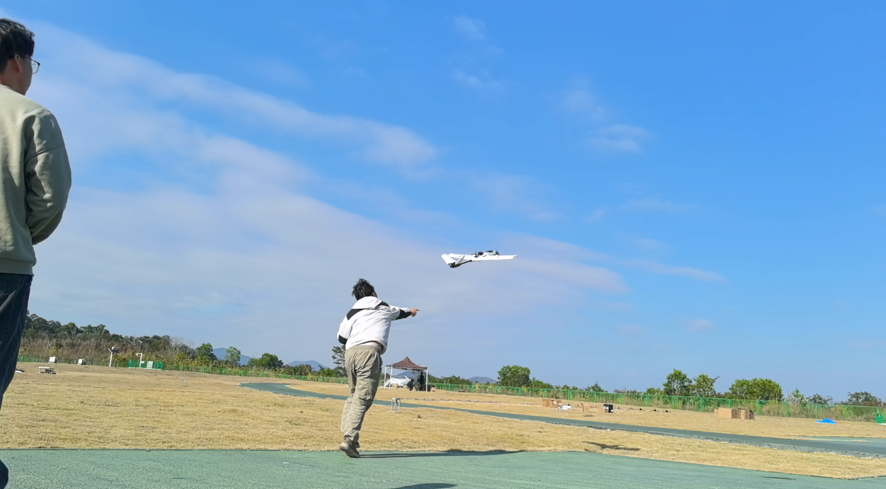

* 若抛飞后，无人机出现未按预期轨迹飞行的情况，如下图：
  * 这可能是由于抛飞时与地面夹角未达到15度或油门动力不足，导致无人机头部下坠趋势未按预期轨迹飞行
  * 若要修正此问题，应左手摇杆向上推高油门，右手摇杆向下打杆拉高无人机飞行高度

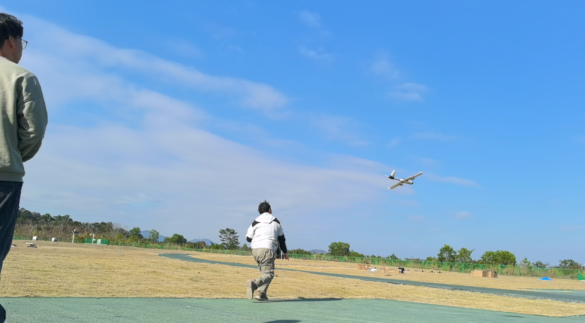

## 手动控制飞行

* 遥控器SA键上、中、下三档，对应自稳、定高、定点，可切换至任意模式下根据飞手习惯手动控制飞行

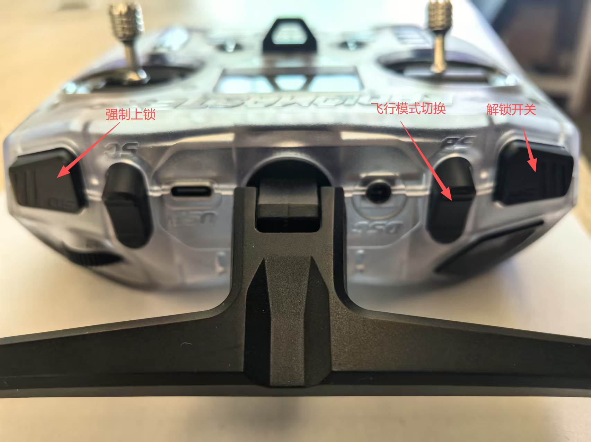

* 若想控制无人机进行拐弯操作，可控制遥控器右手摇杆向左或向右打杆，对应左拐或右拐（摇杆杆量可控制无人机的转弯半径）
* 若想控制无人机进行上升或下降操作（前提保证油门无变化），可控制遥控器右手摇杆向上或向下打杆，（摇杆杆量可控制无人机的上升或后下降速度）

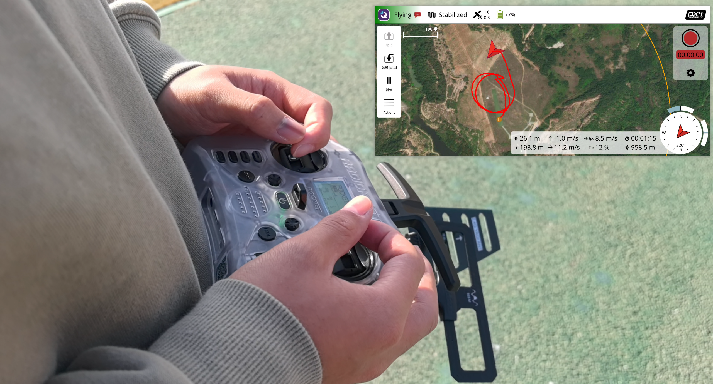

* 起飞后，可在任意模式下控制无人机向左逆时针绕圈飞行
  * 若SA键处于上位——自稳模式，飞手需手动控制飞行高度，可通过左手油门摇杆控制推力，或通过右手俯仰摇杆控制飞机爬升/下降
  * 若SA键处于中位——定高模式，飞手不需要对飞行高度进行控制，飞控会自动保持当前高度，飞手只需控制飞行方向和速度即可
  * 若SA键处于下位——定点模式，飞手不需要对飞行高度进行控制，飞控会自动保持当前高度和水平位置，飞手只需控制飞行方向即可

**三种飞行模式对比总结：**

| 模式 | SA键位置 | 高度控制 | 位置控制 | 飞手操作 |
|------|----------|----------|----------|----------|
| 自稳模式 | 上位 | 手动控制 | 无 | 需控制油门和俯仰来调节高度 |
| 定高模式 | 中位 | 自动控制 | 无 | 只需控制方向，飞控保持高度 |
| 定点模式 | 下位 | 自动控制 | 自动控制 | 只需控制方向，飞控保持高度和位置 |

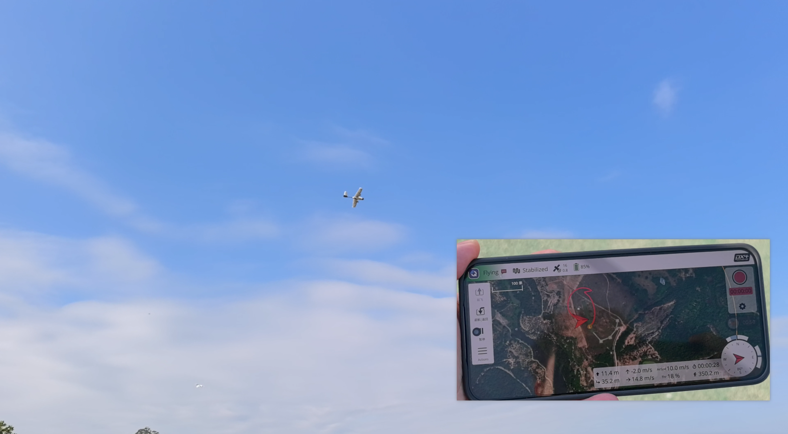

## 降落

* 在固定翼的自稳模式下降低飞行高度、飞行速度、飞行到降落区域
  * 推荐天气晴朗无风条件下（可根据环境不同进行随机应变）在16米高左右，200米无障碍空域，对准飞手面前跑道，保持10米每秒速度，上推右手遥控器摇杆缓慢降低高度，在6米高左右，左手油门收到底，持续上推右手摇杆，使无人机滑翔保持平稳姿态着陆（注意：空速低于8米每秒有失速风险）

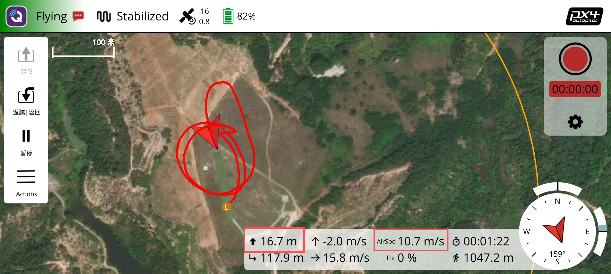

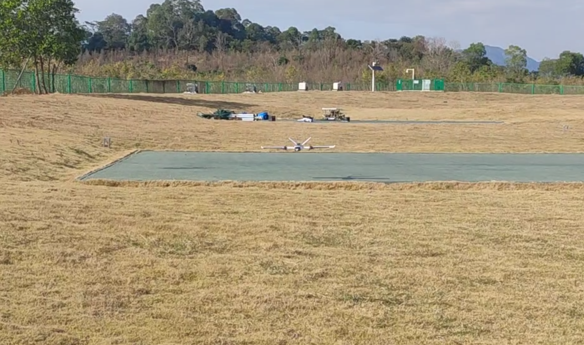

* 下图为高度6米，完全收油状态

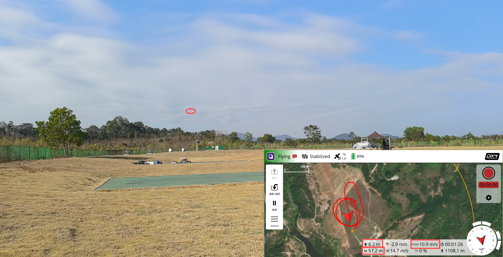

* 等无人机接触地面后，持续拉低油门，等待电机上锁即可完成本次飞行，完成飞行后应及时断开电源

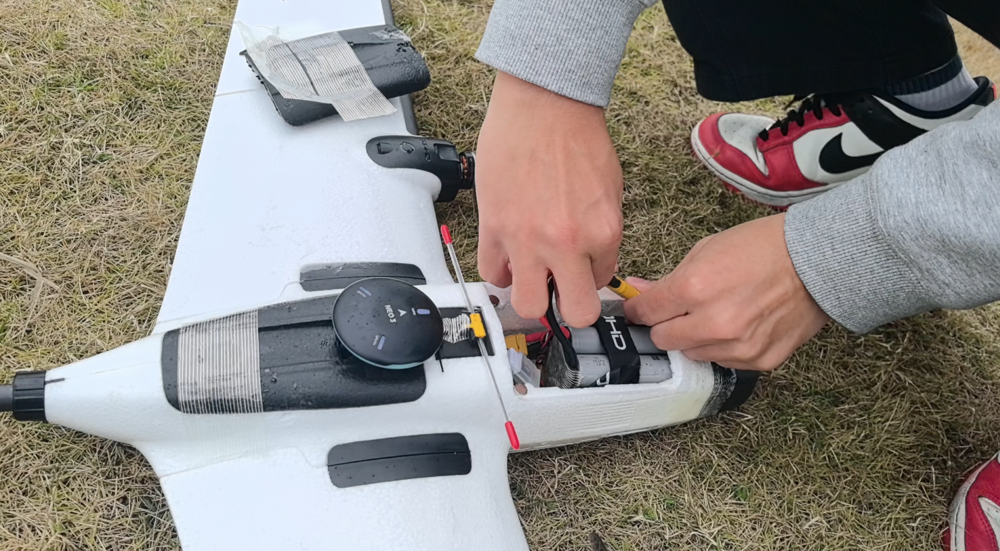
