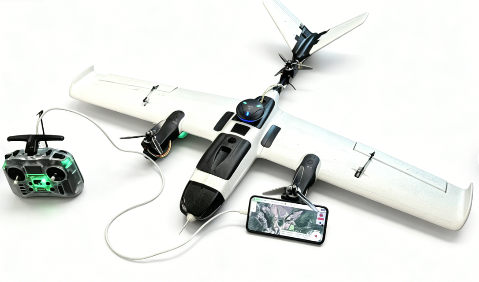
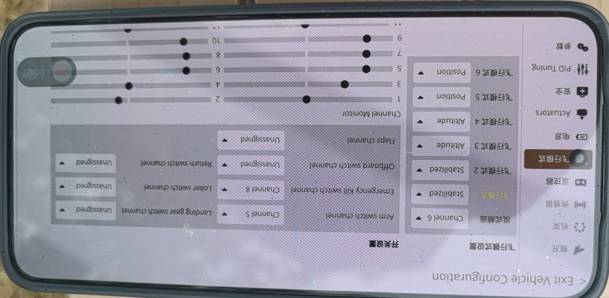
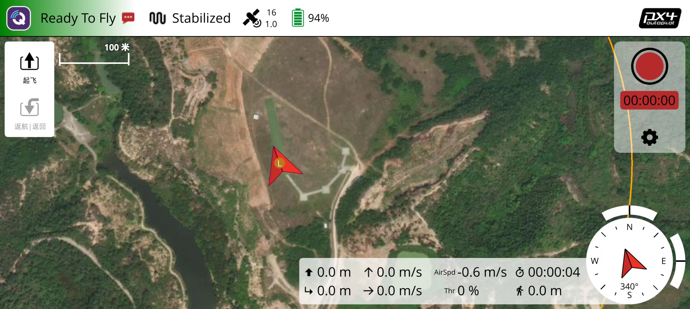
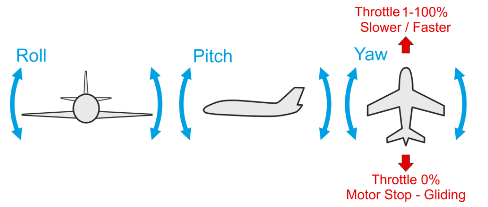
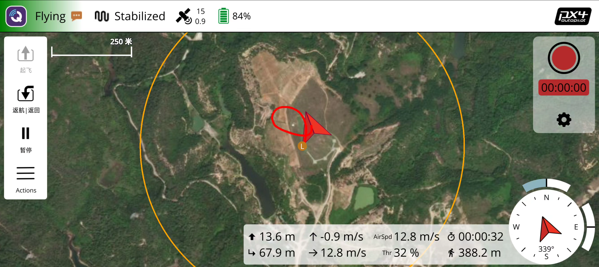
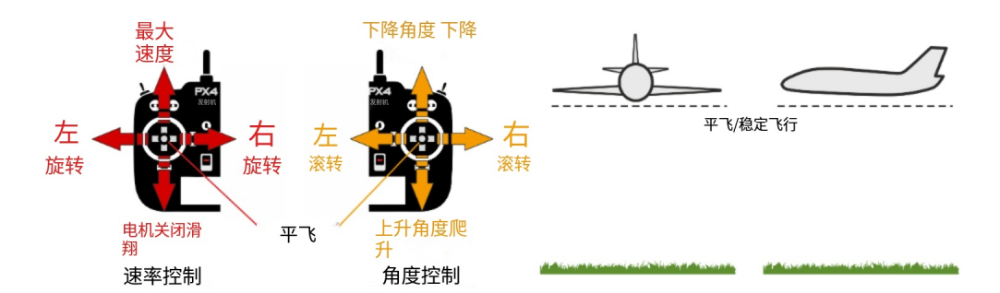
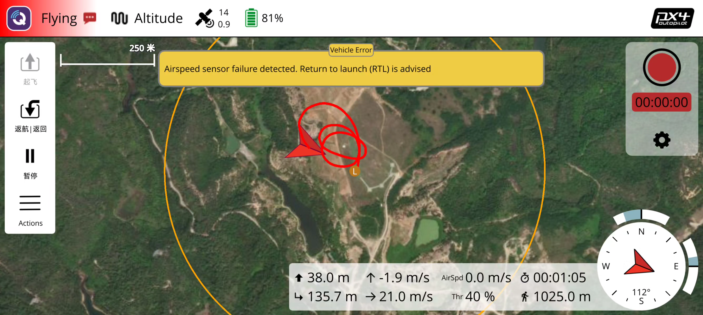
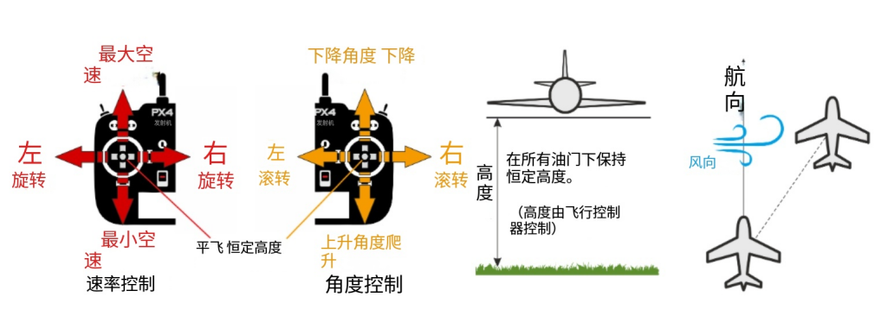
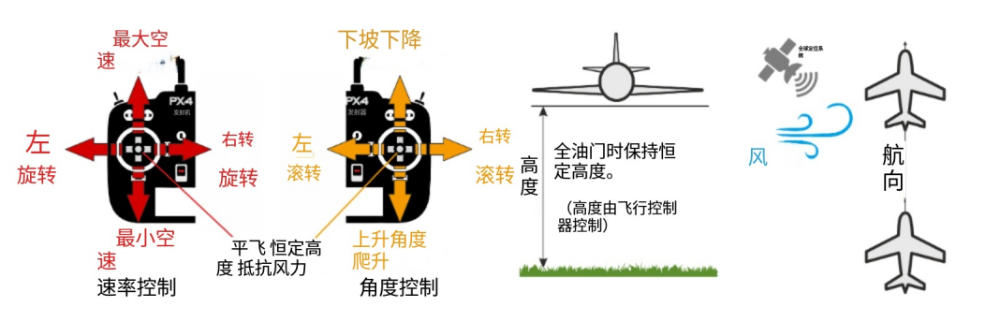

# 手动飞行介绍

* 根据前面教程，准备好硬件、软件
* 首次飞行介绍基于飞控的手动控制飞行

* 起飞前需要先熟悉遥控器对应通道的功能

* 检查VtolS3飞行状态，提示Ready To Fly则说明状态正常

## 解锁抛飞

### 抛飞理论教程

**抛飞基本原理：**

抛飞是固定翼无人机起飞的标准方式，通过手动投掷给予飞机足够的初速度，使机翼产生足够的升力，从而实现平稳起飞。

**抛飞要点：**

1. **起飞角度**：飞机应保持约10-15度的仰角，这个角度能够提供最佳的升力和起飞性能
2. **投掷力度**：用力要适中且连续，避免用力过猛导致飞机失稳，或用力不足导致初速度不够
3. **投掷方向**：应迎风抛飞，逆风方向能够提供更好的升力稳定性
4. **投掷时机**：在风力较小时进行抛飞，避免强风条件下操作
5. **身体姿势**：身体侧对风向，手臂自然伸直，投掷时保持身体平衡

**抛飞步骤：**

1. **解锁无人机**：在自稳模式下解锁无人机，确保电机已解锁
2. **检查环境**：确认前方空域开阔，无障碍物，风力适中
3. **准备姿态**：双手握住机身，保持约10-15度仰角
4. **投掷起飞**：用力向前抛出飞机，同时可轻推油门辅助起飞
5. **接管控制**：飞机离手后立即接管遥控器，控制飞行姿态

**注意事项：**

- ⚠️ 抛飞前确保螺旋桨已正确安装且紧固
- ⚠️ 抛飞时远离人群和障碍物，确保安全距离
- ⚠️ 初学者建议在有经验人员指导下进行首次抛飞
- ⚠️ 如抛飞失败，立即切换到VTOL模式进行垂直起飞

* 在自稳模式下解锁无人机，手动飞行

## 手动控制飞行

### 飞机姿态变化理论教程

**飞机姿态基本概念：**

飞机姿态是指飞机在空间中的方向和角度状态，主要包括以下三个轴向的运动：

1. **俯仰**：机头向上或向下的运动
2. **横滚**：飞机向左或向右倾斜
3. **偏航**：飞机绕垂直轴旋转（转向）

**姿态控制原理：**

固定翼通过改变机翼的迎角来控制升力，从而实现姿态变化：

- **俯仰控制**：通过右手摇杆上下控制改变机翼的迎角，控制飞机的爬升或下降
- **横滚控制**：通过右手摇杆左右控制左右机翼差动，控制飞机的左右倾斜
- **偏航控制**：通过左手摇杆左右控制尾翼的方向偏转，控制飞机的转向

**姿态变化对飞行的影响：**

1. **俯仰变化**：

   - 机头向上（爬升）：增加迎角，升力增大，飞机上升
   - 机头向下（俯冲）：减小迎角，升力减小，飞机下降
2. **横滚变化**：

   - 向左倾斜：右翼升力增大，左翼升力减小，飞机向左倾斜
   - 向右倾斜：左翼升力增大，右翼升力减小，飞机向右倾斜
3. **偏航变化**：

   - 左转：垂直尾翼向左偏转，飞机向左转向
   - 右转：垂直尾翼向右偏转，飞机向右转向

* 在任意模式下根据飞手习惯手动控制飞行

**三种飞行模式对比总结：**

| 模式     | SA键位置 | 高度控制 | 位置控制 | 飞手操作                         |
| -------- | -------- | -------- | -------- | -------------------------------- |
| 自稳模式 | 上位     | 手动控制 | 无       | 需控制油门和俯仰来调节高度       |
| 定高模式 | 中位     | 自动控制 | 无       | 只需控制方向，飞控保持高度       |
| 定点模式 | 下位     | 自动控制 | 自动控制 | 只需控制方向，飞控保持高度和位置 |

*自稳模式*

* 横滚和俯仰是角度控制的（不能上下滚动或循环）
* 如果油门降至 0％（电机停止），飞机将滑行。 为了执行转弯，必须在整个操纵过程中保持命令，因为如果释放横滚摇杆，则飞机将停止转动并自行调平（对于俯仰和偏航命令也是如此）
* 偏航杆可以用来增加/减少飞机在转弯时的偏航率。如果留在中心，控制器会自行进行转弯协调，这意味着它将应用当前滚转角的必要偏航率来执行平稳转弯。

*定高模式*

* 高空飞行模式是最安全、最简单的非gps手动模式。它使飞行员更容易控制车辆高度，特别是达到并保持固定高度。该模式不会试图保持车辆逆风航向。空速是主动控制，如果一个空速传感器安装。
* 当所有遥控输入都居中时（无滚动、俯仰、偏航，油门约 50％），飞机将恢复直线水平飞行（受风影响）并保持其当前高度。
* 偏航杆可以用来增加/减少飞机在转弯时的偏航率。如果留在中心，控制器会自行进行转弯协调，这意味着它将应用当前滚转角的必要偏航率来执行平稳转弯。

*定点模式*

* 定位模式是最简单、最安全的手动模式。它支持具有位置估计（例如GPS）的飞机。它使飞行员更容易控制飞机高度，特别是达到并保持固定高度。这种模式可以使飞机逆风行驶。空速是主动控制，如果一个空速传感器安装。
* 当所有操纵杆释放/居中（无滚转、俯仰、偏航和~50%油门）时，飞机将返回直线、水平飞行，并保持当前高度和飞行路径，而不受风的影响。这使得在飞行时很容易从任何问题中恢复过来。侧倾和俯仰都是角度控制的（所以不可能翻车或绕车）。
* 偏航杆可以用来增加/减少车辆在转弯时的偏航率。如果留在中心，控制器会自行进行转弯协调，这意味着它将应用当前滚转角的必要偏航率来执行平稳转弯。下图直观地显示了模式行为（对于模式2发射机）

## 降落

### 降落理论教程

**降落基本原理：**

降落是固定翼无人机飞行中最重要的环节之一，通过控制飞机的高度和速度，使飞机安全平稳地着陆。降落过程需要精确控制飞机的姿态和速度，确保飞机以适当的速度和角度接触地面。

**降落阶段划分：**

1. **进场阶段**：从巡航高度下降至着陆高度
2. **下滑阶段**：保持稳定的下滑角度和速度
3. **拉平阶段**：接地前减小下降率，使飞机平稳接地
4. **滑跑阶段**：接地后保持方向，减速至停止

**降落关键参数：**

- **进场高度**：推荐16米左右，确保有足够的空间进行调整
- **进场速度**：推荐10米/秒，保持稳定的飞行状态
- **下滑角度**：约3-5度，确保平稳下降
- **接地速度**：约8-10米/秒，避免失速或重着陆
- **空域要求**：200米无障碍空域，确保有足够的机动空间

**降落操作原理：**

1. **高度控制**：

   - 通过右手摇杆（俯仰）控制飞机的升降
   - 下拉摇杆：机头向上，增加升力，减缓下降
   - 上推摇杆：机头向下，减小升力，加快下降
2. **速度控制**：

   - 通过左手油门控制飞机的推力
   - 增加油门：增加推力，提高速度
   - 减小油门：减小推力，降低速度
   - 着陆前收油门：使飞机进入滑翔状态
3. **方向控制**：

   - 通过右手摇杆（横滚）控制飞机的左右倾斜
   - 配合尾翼控制飞机的转向

**降落技巧：**

- **逆风着陆**：逆风方向着陆可以减小接地速度，提高安全性
- **保持稳定**：保持飞机姿态稳定，避免剧烈操作
- **预判调整**：提前预判飞机状态，提前进行调整
- **视线引导**：保持视线看向着陆点，引导飞机准确着陆

**常见降落问题：**

- ⚠️ 失速：空速过低导致升力不足，飞机失控
- ⚠️ 重着陆：下降率过大，飞机硬着陆
- ⚠️ 飘降：速度过快，飞机无法及时接地
- ⚠️ 偏离跑道：方向控制不当，飞机偏离着陆点
- ✅ 正确降落：平稳接地，滑跑距离适中

**安全注意事项：**

- 确保着陆场地平整、开阔，无障碍物
- 避免在强风、雨天等恶劣天气条件下降落
- 保持足够的安全距离，远离人群和建筑物
- 如降落失败，立即复飞，重新进行降落程序

* 等无人机接触地面后，持续拉低油门，等待电机上锁即可完成本次飞行，完成飞行后应及时断开电源

