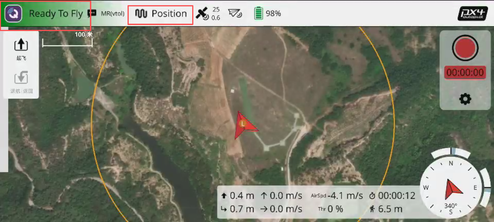
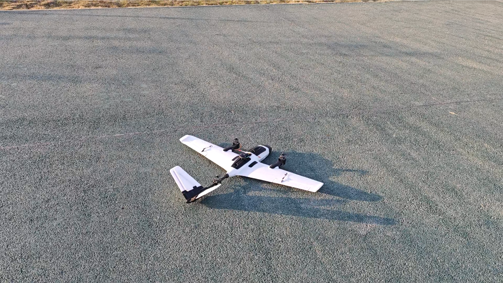
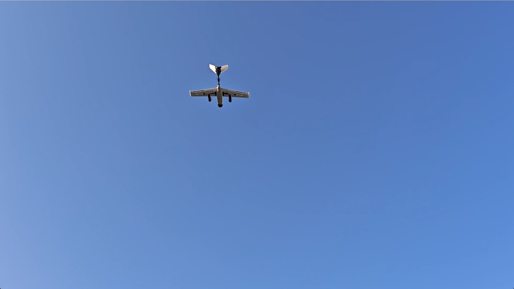
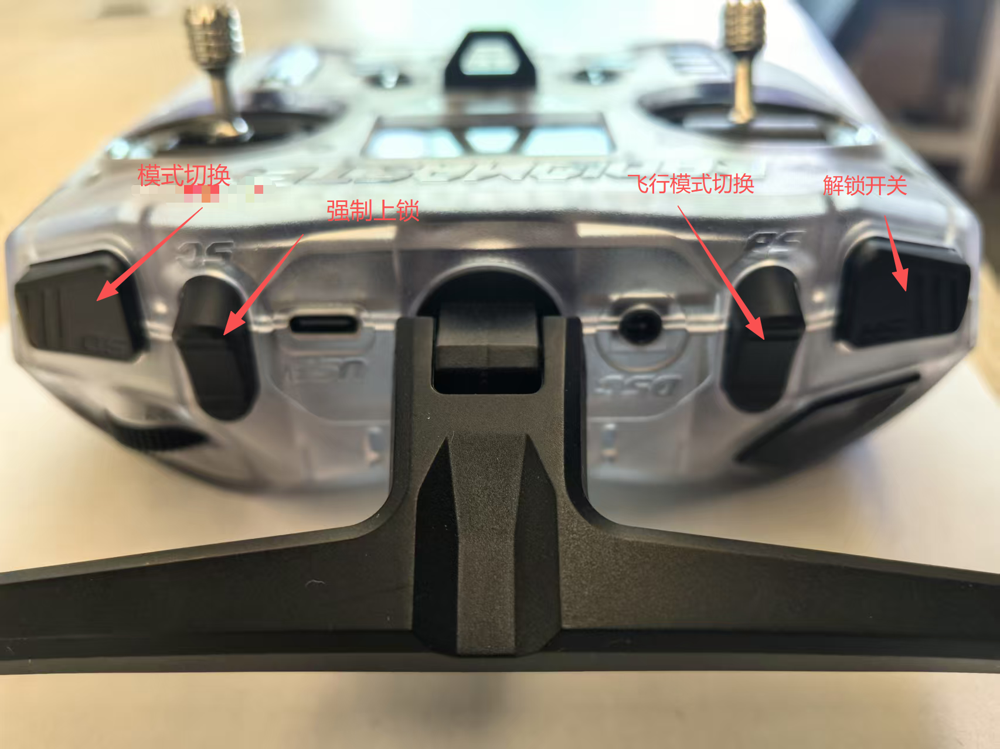
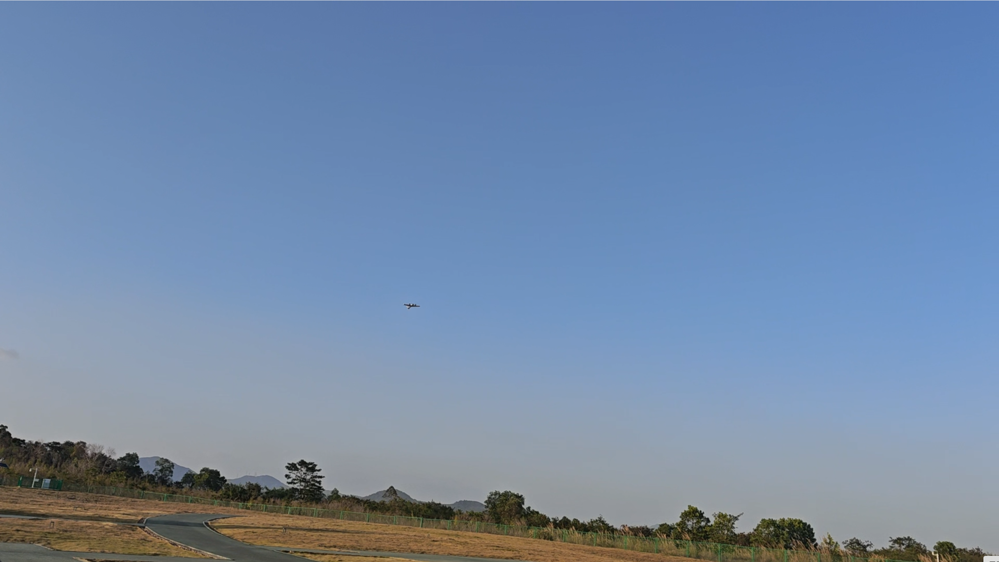
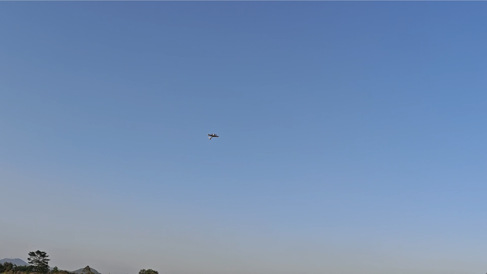

# 完整飞行演示

## 准备阶段

1. 确认电池电量充足
2. 检查确认固定翼舵面正常
3. 检查电机转向无误（左前顺时针，右前和尾电机逆时针），注意螺旋桨安装方向上与电机转向同向的螺旋桨，螺母一定要固定死
4. 用纤维胶带将飞机舱盖粘好防止意外脱落

## 解锁起飞

* 待定点模式下出现“ready to fly”（大致搜星至12颗星以上），在定点模式下可进行解锁起飞

* 对向逆风方向，旋翼定点模式起飞，解锁飞机，遥控器左手油门摇杆向上推至60%以上，准备就绪即可起飞飞
  * 注意：需要熟悉旋翼定点模式，最好有飞行经验，起飞后可切换其他模式飞行

* 待无人机起飞后，飞行至20米左右高度，可准备按下模式切换键切换至固定翼模式

## 手动控制飞行

* 遥控器SA键上、中、下三档，对应自稳、定高、定点，可切换至任意模式下根据飞手习惯手动控制飞行

* 若想在固定翼模式下控制无人机进行拐弯操作，可控制遥控器右手摇杆向左或向右打杆，对应左拐或右拐（摇杆杆量可控制无人机的转弯半径）
* 若想在固定翼模式下控制无人机进行上升或下降操作（前提保证油门无变化），可控制遥控器右手摇杆向上或向下打杆，（摇杆杆量可控制无人机的上升或后下降速度）

* 起飞后，可在任意模式下控制无人机向左逆时针绕圈飞行
  * 若SA键处于上位——自稳模式，飞手需手动控制飞行高度，可通过左手油门摇杆控制推力，或通过右手俯仰摇杆控制飞机爬升/下降
  * 若SA键处于中位——定高模式，飞手不需要对飞行高度进行控制，飞控会自动保持当前高度，飞手只需控制飞行方向和速度即可
  * 若SA键处于下位——定点模式，飞手不需要对飞行高度进行控制，飞控会自动保持当前高度和水平位置，飞手只需控制飞行方向即可

**三种飞行模式对比总结：**

| 模式     | SA键位置 | 高度控制 | 位置控制 | 飞手操作                         |
| -------- | -------- | -------- | -------- | -------------------------------- |
| 自稳模式 | 上位     | 手动控制 | 无       | 需控制油门和俯仰来调节高度       |
| 定高模式 | 中位     | 自动控制 | 无       | 只需控制方向，飞控保持高度       |
| 定点模式 | 下位     | 自动控制 | 自动控制 | 只需控制方向，飞控保持高度和位置 |

## 降落

* 在固定翼的定点模式下降低飞行高度、飞行速度、飞行到降落区域
  * 推荐天气晴朗无风条件下（可根据环境不同进行随机应变）在16米高左右，200米无障碍空域，对准飞手面前跑道，保持10米每秒速度，定点模式下上推右手遥控器摇杆缓慢降低高度，注意预留20米左右距离切换至旋翼模式（注意：空速低于8米每秒有失速风险）

* 切换至旋翼定点模式，上推右手遥控器摇杆缓慢降低高度，预留20米左右距离切换至旋翼模式（注意逆风降落）

* 等无人机接触地面后，持续拉低油门，等待电机上锁即可完成本次飞行，完成飞行后应及时断开电源

