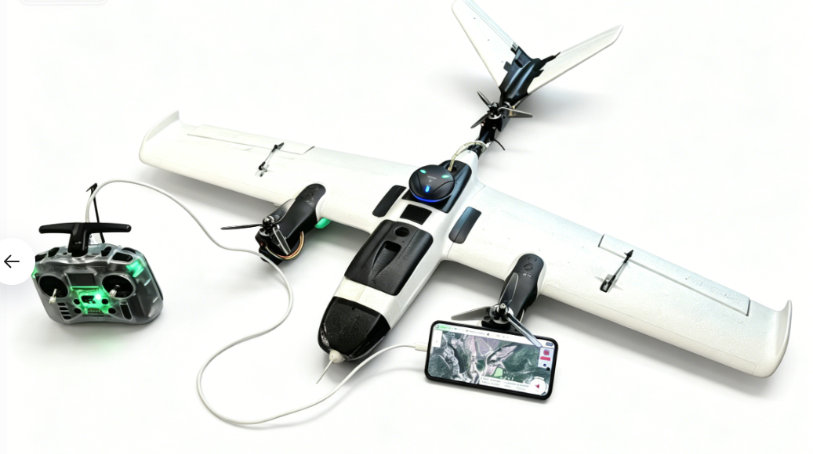
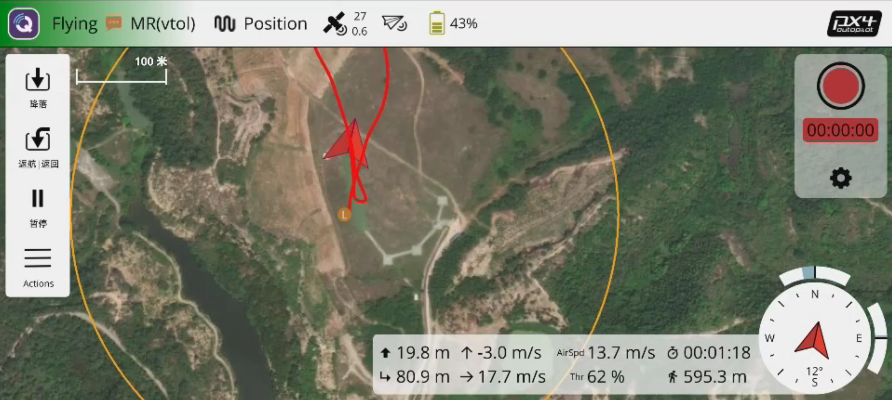
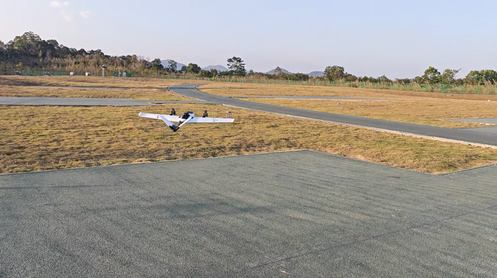
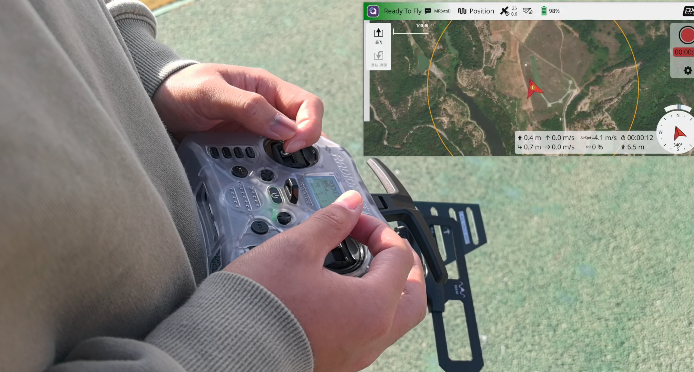
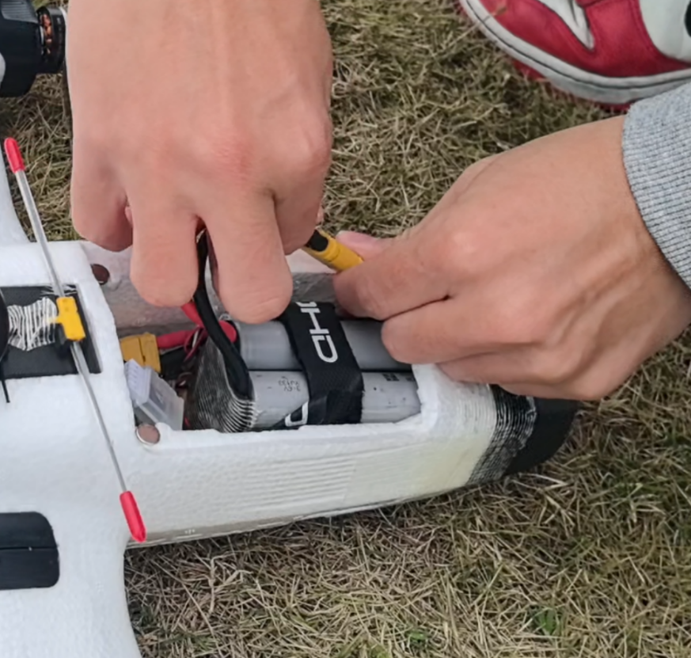

# 垂起固定翼手动飞行介绍

* 根据前面教程，准备好硬件、软件
* 首次飞行介绍基于飞控的手动控制飞行

* 起飞前需要先熟悉遥控器对应通道的功能

* 检查VtolS3飞行状态，提示Ready To Fly则说明状态正常

## 飞行必看注意事项

### ⚠️ 【新手飞行关键注意事项】⚠️

**🔴 重要提醒：**
- **⚠️ 新手必须在定点模式下完成飞行，严禁在其他模式下飞行**
- **⚠️ 固定翼模式中必须全程保持遥控器油门中位附近，避免高油门操作**
- **⚠️ 旋翼模式切换至固定翼模式时，必须确保遥控器油门处于中位**

### ⚠️ 【安全飞行警告】⚠️

**这些操作不当可能导致：**
- ✖️ 飞机失控
- ✖️ 坠机损坏
- ✖️ 安全事故

**请严格遵守以上操作规范！**

### 紧急情况处理

**常见故障及处理：**

| 故障情况     | 可能原因               | 处理方法                                   |
| ------------ | ---------------------- | ------------------------------------------ |
| 飞机失去控制 | 遥控信号丢失           | 立即切换至故障保护模式，等待自动返航或降落 |
| GPS定位异常  | 信号干扰或卫星数量不足 | 切换至自稳模式，手动控制飞行               |
| 飞机姿态异常 | 飞控传感器故障         | 尝试切换飞行模式，如无法控制则紧急降落     |
| 电池电量过低 | 飞行时间过长           | 立即返航，避免低电量降落                   |

**应急措施：**

- ⚠️ 发生紧急情况时，首先保持冷静，切勿猛推摇杆
- ⚠️ 记录飞行数据，以便分析故障原因
- ⚠️ 每次飞行后进行设备检查和维护

## 解锁起飞

### 垂直起飞理论教程

**垂直起飞基本原理：**

垂起固定翼(VTOL)无人机结合了多旋翼和固定翼的优点，可以在垂直方向起飞和降落，同时具备固定翼的高效巡航能力。垂直起飞时，飞机像多旋翼一样通过多个电机产生升力直接升空。

**垂直起飞要点：**

1. **起飞位置**：选择平坦、开阔的地面，确保周围无障碍物
2. **飞机姿态**：保持飞机水平放置，确保重心稳定
3. **油门控制**：缓慢增加油门，避免突然推满导致飞机失控
4. **高度控制**：起飞后保持悬停，确认飞机稳定后再进行其他操作
5. **环境条件**：避免在强风条件下垂直起飞，风力会影响悬停稳定性

**垂直起飞步骤：**

1. **解锁无人机**：在旋翼模式下解锁无人机，确保电机已解锁
2. **检查环境**：确认周围空域开阔，无障碍物，风力适中
3. **缓慢起飞**：缓慢推油门，飞机将垂直升空
4. **稳定悬停**：起飞至20米高度，保持悬停，确认飞机稳定
5. **切换至固定翼模式**：将飞机由旋翼模式切换至固定翼模式
6. **切换模式**：确认稳定后，可切换至固定翼模式进行巡航飞行

**注意事项：**

- ⚠️ 垂直起飞时缓慢增加油门，避免突然推满
- ⚠️ 起飞前确保所有螺旋桨已正确安装且紧固
- ⚠️ 起飞时远离人群和障碍物，确保安全距离
- ⚠️ 初学者建议在有经验人员指导下进行首次起飞
- ⚠️ 如起飞过程中出现不稳定，立即降低油门降落
- ⚠️ 确保电池电量充足，建议起飞前电量在80%以上

* 在旋翼模式下解锁无人机，进行垂直起飞

## 手动控制飞行

### 飞机姿态变化理论教程

**飞机姿态基本概念：**

飞机姿态是指飞机在空间中的方向和角度状态，主要包括以下三个轴向的运动：

1. **俯仰**：机头向上或向下的运动
2. **横滚**：飞机向左或向右倾斜
3. **偏航**：飞机绕垂直轴旋转（转向）

**姿态控制原理：**

- **VTOL模式（多旋翼模式）**：通过改变各电机的转速差来控制姿态

  - 俯仰控制：前后电机转速差
  - 横滚控制：左右电机转速差
  - 偏航控制：对角电机转速差
  - 升降控制：所有电机同时增减转速
- **固定翼模式**：通过改变机翼的迎角和舵面来控制姿态

  - 俯仰控制：通过右手摇杆上下控制改变机翼的迎角
  - 横滚控制：通过右手摇杆左右控制左右机翼差动
  - 偏航控制：通过左手摇杆左右控制尾翼的方向偏转

**姿态变化对飞行的影响：**

1. **俯仰变化**：

   - 机头向上（爬升）：增加迎角，升力增大，飞机上升
   - 机头向下（俯冲）：减小迎角，升力减小，飞机下降
2. **横滚变化**：

   - 向左倾斜：右翼升力增大，左翼升力减小，飞机向左倾斜
   - 向右倾斜：左翼升力增大，右翼升力减小，飞机向右倾斜
3. **偏航变化**：

   - 左转：垂直尾翼向左偏转，飞机向左转向
   - 右转：垂直尾翼向右偏转，飞机向右转向

* 在任意模式下根据飞手习惯手动控制飞行

**飞行模式对比总结：**

| 模式     | SA键位置 | 高度控制 | 位置控制 | 飞手操作                         |
| -------- | -------- | -------- | -------- | -------------------------------- |
| 自稳模式 | 上位     | 手动控制 | 无       | 需控制油门和俯仰来调节高度       |
| 定高模式 | 中位     | 自动控制 | 无       | 只需控制方向，飞控保持高度       |
| 定点模式 | 下位     | 自动控制 | 自动控制 | 只需控制方向，飞控保持高度和位置 |

*固定翼自稳模式*

* 横滚和俯仰是角度控制的（不能上下滚动或循环）
* 如果油门降至 0％（电机停止），飞机将滑行。 为了执行转弯，必须在整个操纵过程中保持命令，因为如果释放横滚摇杆，则飞机将停止转动并自行调平（对于俯仰和偏航命令也是如此）
* 偏航杆可以用来增加/减少飞机在转弯时的偏航率。如果留在中心，控制器会自行进行转弯协调，这意味着它将应用当前滚转角的必要偏航率来执行平稳转弯。

*固定翼定高模式*

* 高空飞行模式是最安全、最简单的非gps手动模式。它使飞行员更容易控制车辆高度，特别是达到并保持固定高度。该模式不会试图保持无人机逆风航向。空速是主动控制，如果一个空速传感器安装。
* 当所有遥控输入都居中时（无滚动、俯仰、偏航，油门约 50％），飞机将恢复直线水平飞行（受风影响）并保持其当前高度。
* 偏航杆可以用来增加/减少飞机在转弯时的偏航率。如果留在中心，控制器会自行进行转弯协调，这意味着它将应用当前滚转角的必要偏航率来执行平稳转弯。

*固定翼定点模式*

* 定位模式是最简单、最安全的手动模式。它支持具有位置估计（例如GPS）的飞机。它使飞行员更容易控制飞机高度，特别是达到并保持固定高度。这种模式可以使飞机逆风行驶。空速是主动控制，如果一个空速传感器安装。
* 当所有操纵杆释放/居中（无滚转、俯仰、偏航和~50%油门）时，飞机将返回直线、水平飞行，并保持当前高度和飞行路径，而不受风的影响。这使得在飞行时很容易从任何问题中恢复过来。侧倾和俯仰都是角度控制的（所以不可能翻车或绕车）。
* 偏航杆可以用来增加/减少车辆在转弯时的偏航率。如果留在中心，控制器会自行进行转弯协调，这意味着它将应用当前滚转角的必要偏航率来执行平稳转弯。下图直观地显示了模式行为（对于模式2发射机）

## 旋翼模式操作模式

### 1. 自稳模式（Stabilize）

- **控制特点**：横滚和俯仰角度控制，油门控制高度
- **操作方式**：需要手动控制油门来保持高度，摇杆回中时飞机会保持当前姿态
- **适用场景**：适合有经验的飞手，需要精确控制飞机姿态
- **注意事项**：需要持续调整油门来维持高度，不适合新手长时间飞行

### 2. 定高模式（Altitude Hold）

- **控制特点**：飞控自动保持当前高度，横滚和俯仰角度控制
- **操作方式**：油门控制垂直速度（上推增加高度，下拉降低高度），松开油门后保持当前高度
- **适用场景**：适合初学者，无需担心高度控制
- **注意事项**：高度保持依赖气压计，在强风和气压变化较大的环境下可能有误差

### 3. 定点模式（Position Hold）

- **控制特点**：飞控自动保持当前位置和高度
- **操作方式**：摇杆控制飞机移动方向和速度，松开摇杆后自动回到定点位置
- **适用场景**：适合需要精确悬停的场景，如拍照、巡检等
- **注意事项**：需要良好的GPS信号，在GPS信号弱的环境下可能无法正常工作

**模式切换建议**：

- 初学者建议从定高模式开始，熟悉基本操作后再尝试自稳模式
- 进行精确悬停操作时使用定点模式
- 注意各模式的信号要求和环境限制

## 降落

### 垂直降落理论教程

**垂直降落基本原理：**

垂起固定翼无人机最大的优势之一就是可以像多旋翼一样垂直降落，无需跑道。垂直降落时，飞机在旋翼模式下缓慢下降，直至接触地面。

**垂直降落要点：**

1. **切换至旋翼模式**：在降落前将飞机由固定翼模式切换至旋翼模式
2. **选择降落点**：选择平坦、开阔的地面，确保周围无障碍物
3. **缓慢下降**：缓慢降低油门，控制飞机缓慢下降
4. **保持水平**：降落过程中保持飞机水平，避免倾斜
5. **接地时机**：当飞机接近地面时，进一步降低油门，使飞机平稳接地

**垂直降落步骤：**

1. **返航至降落点**：将飞机飞回起飞点或选定的降落区域
2. **切换至旋翼模式**：将飞机切换至旋翼模式
3. **稳定悬停**：在降落点上空3-5米高度稳定悬停
4. **缓慢下降**：缓慢降低油门，控制飞机缓慢下降
5. **平稳接地**：当飞机接近地面时，进一步降低油门，使飞机平稳接地
6. **锁定电机**：飞机接地后，将油门拉至最低，等待电机锁定

**注意事项：**

- ⚠️ 降落前确保降落点平整、开阔，无障碍物
- ⚠️ 降落过程中保持飞机水平，避免倾斜导致侧翻
- ⚠️ 避免在强风条件下垂直降落，风力会影响悬停稳定性
- ⚠️ 如降落过程中出现不稳定，立即增加油门重新悬停
- ⚠️ 确保电池电量充足，建议降落前电量不低于20%
- ⚠️ 接地后立即拉低油门，等待电机锁定
- ⚠️ 飞行结束后及时断开电池电源

**降落阶段划分：**

1. **进场阶段**：从巡航高度下降至着陆高度
2. **下滑阶段**：保持稳定的下滑角度和速度
3. **拉平阶段**：接地前减小下降率，使飞机平稳接地
4. **滑跑阶段**：接地后保持方向，减速至停止

**降落关键参数：**

- **进场高度**：推荐16米左右，确保有足够的空间进行调整
- **进场速度**：推荐10米/秒，保持稳定的飞行状态
- **下滑角度**：约3-5度，确保平稳下降
- **空域要求**：200米无障碍空域，确保有足够的机动空间

**降落操作原理：**

1. **高度控制**：

   - 通过右手摇杆（俯仰）控制飞机的升降
   - 下拉摇杆：机头向上，增加升力，减缓下降
   - 上推摇杆：机头向下，减小升力，加快下降
2. **速度控制**：

   - 通过左手油门控制飞机的推力
   - 增加油门：增加推力，提高速度
   - 减小油门：减小推力，降低速度
   - 着陆前收油门：使飞机进入滑翔状态
3. **方向控制**：

   - 通过右手摇杆（横滚）控制飞机的左右倾斜
   - 配合尾翼控制飞机的转向

**降落技巧：**

- **逆风着陆**：逆风方向着陆可以减小接地速度，提高安全性
- **保持稳定**：保持飞机姿态稳定，避免剧烈操作
- **预判调整**：提前预判飞机状态，提前进行调整
- **视线引导**：保持视线看向着陆点，引导飞机准确着陆

**常见降落问题：**

- ⚠️ 失速：空速过低导致升力不足，飞机失控
- ⚠️ 偏离跑道：方向控制不当，飞机偏离着陆点
- ✅ 正确降落：平稳接地，滑跑距离适中

**安全注意事项：**

- 确保着陆场地平整、开阔，无障碍物
- 避免在强风、雨天等恶劣天气条件下降落
- 保持足够的安全距离，远离人群和建筑物
- 切换至VTOL模式垂直降落

* 等无人机接触地面后，持续拉低油门，等待电机上锁即可完成本次飞行，完成飞行后应及时断开电源

## 模式切换

### 旋翼与固定翼模式切换

**切换原理：**

垂起固定翼无人机可以在旋翼模式（多旋翼模式）和固定翼模式之间切换，以适应不同的飞行需求。

**切换时机：**

- **旋翼转固定翼**：起飞后，飞机达到一定高度和速度，确认稳定后进行切换
- **固定翼转旋翼**：降落前，将飞机飞回降落区域上空，准备垂直降落

**切换步骤：**

1. **旋翼转固定翼**：

   - 确保飞机在VTOL模式下稳定悬停
   - 向前推俯仰杆，使飞机产生向前的速度
   - 当飞机达到一定速度后，切换至固定翼模式
   - 飞控将自动完成模式转换，前拉电机启动
2. **固定翼转旋翼**：

   - 确保飞机在固定翼模式下稳定飞行
   - 将飞机飞回降落区域上空
   - 降低油门，减小飞行速度
   - 当飞机速度降低到一定程度后，切换至旋翼模式
   - 飞控将自动完成模式转换，前拉电机关闭

**注意事项：**

- ⚠️ 模式切换时确保飞机姿态稳定
- ⚠️ 固定翼转旋翼时需要降低飞行速度
- ⚠️ 切换过程中如出现异常，立即切回原模式
